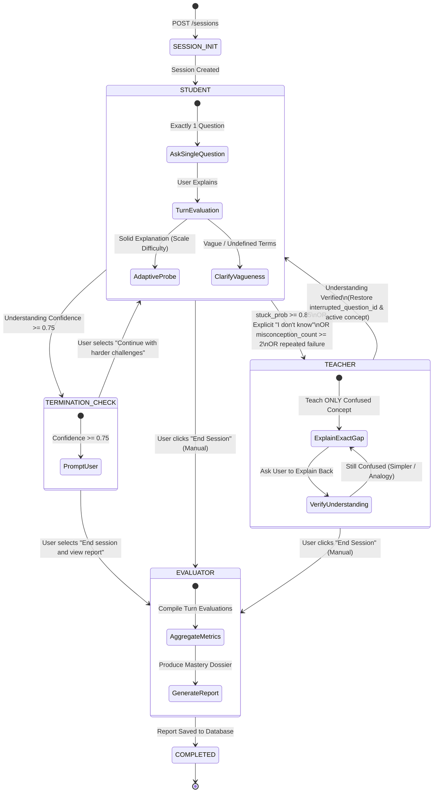
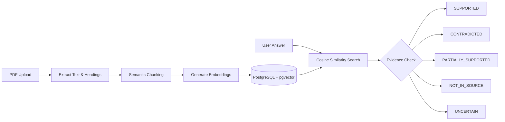
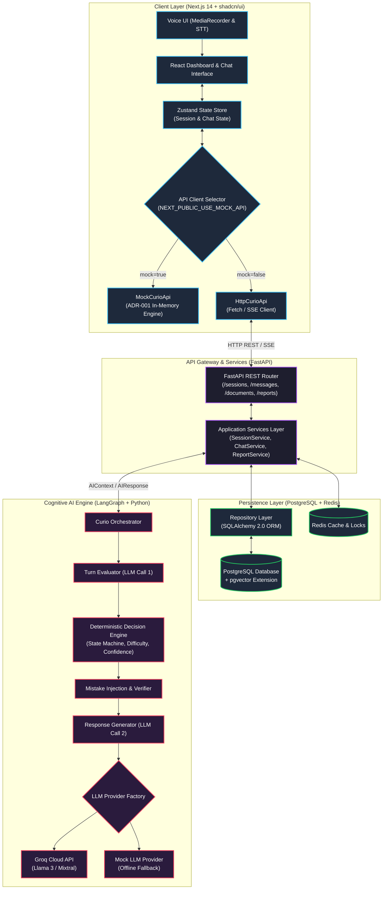
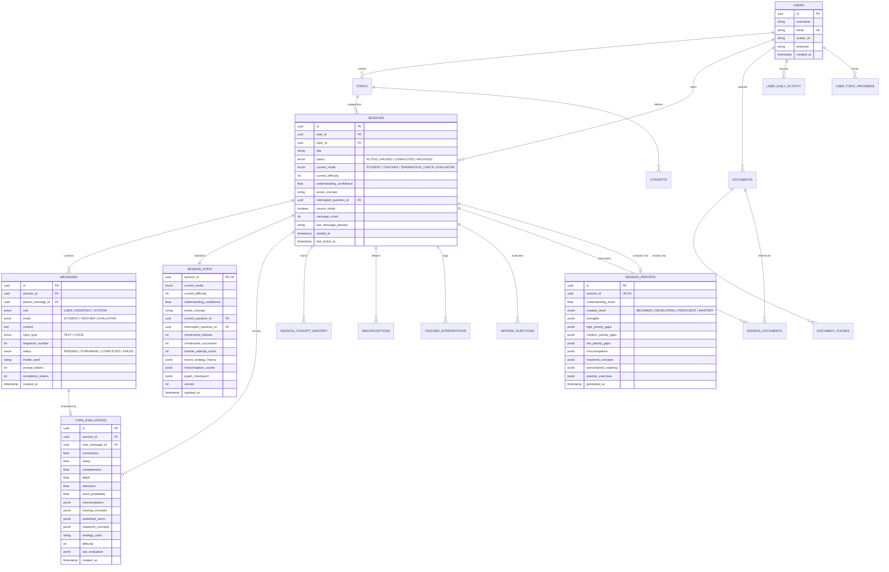
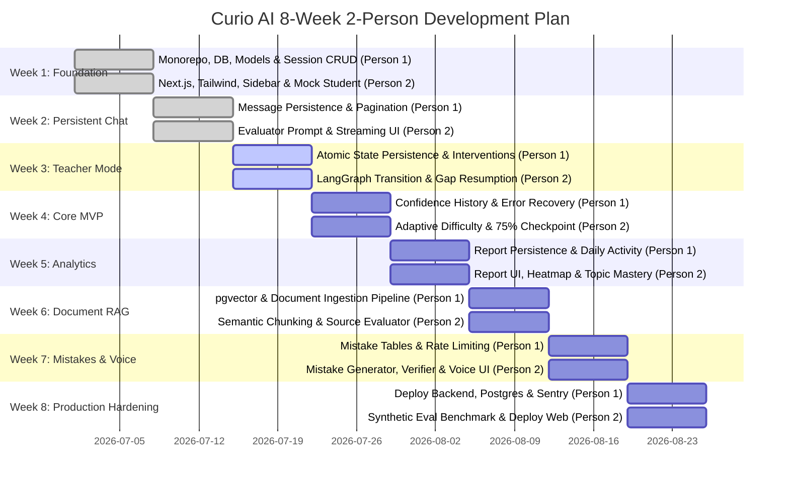

<div align="center">

# 🦉 Curio AI

### *The Stateful Reverse-Tutor AI Platform Powered by the Feynman Technique*

[](LICENSE)
[](https://nextjs.org/)
[](https://fastapi.tiangolo.com/)
[](https://www.python.org/)
[](https://www.typescriptlang.org/)
[](https://www.postgresql.org/)
[](https://groq.com/)
[](https://langchain-ai.github.io/langgraph/)
[](docker-compose.yml)
[](https://github.com/joshi-chinmay-016/Curio-AI/pulls)

<p align="center">
  <b>"You learn by teaching." — The Feynman Technique Reimagined.</b><br>
  <i>Most AI educational tools answer your questions. Curio AI makes you answer theirs. By reversing the conversational dynamic, Curio AI turns you into the teacher and the AI into an inquisitive student—challenging your assumptions, probing edge cases, detecting subtle misconceptions, and intervening only when you are truly stuck.</i>
</p>

<p align="center">
  <a href="#-core-philosophy--the-feynman-technique">Core Philosophy</a> •
  <a href="#-the-three-core-modes--state-machine">Core Modes</a> •
  <a href="#-interactive-session-walkthrough">Session Walkthrough</a> •
  <a href="#-structured-turn-evaluation-pipeline">Evaluation Pipeline</a> •
  <a href="#-adaptive-intelligence-engines">Adaptive Engines</a> •
  <a href="#-dynamic-mistake-injection">Mistake Injection</a> •
  <a href="#-file--pdf-learning-mode-rag">Document RAG</a> •
  <a href="#-persistent-chat-history--session-restoration">Session Restoration</a> •
  <a href="#-system-architecture">System Architecture</a> •
  <a href="#-database-schema--entity-relationships">Database Schema</a> •
  <a href="#-rest-api-reference">API Reference</a> •
  <a href="#-two-person-team-ownership--the-golden-rules">Team Ownership</a> •
  <a href="#-8-week-development-roadmap">8-Week Roadmap</a> •
  <a href="#-quickstart-guide">Quickstart</a> •
  <a href="#-frequently-asked-questions">FAQ</a>
</p>

</div>

---

## 🎯 Core Philosophy & The Feynman Technique

> [!IMPORTANT]
> **"If you want to master something, teach it. The ultimate test of your knowledge is your capacity to convey it to another."** — *Richard Feynman*

### The Problem: The "Illusion of Competence"
Traditional AI chatbots encourage **passive consumption**. When an LLM explains quantum computing, database isolation levels, or binary search trees, it produces articulate, perfectly structured answers. The learner nods along, experiencing the cognitive bias known as the *illusion of competence*—mistaking recognition for true mastery. The moment they are asked to implement, defend, or explain the concept without AI assistance, their knowledge breaks down.

### The Solution: The Reverse-Tutor Paradigm
Curio AI reverses the conversational dynamic:

```
┌─────────────────────────────────────────────────────────────────────────────┐
│                       TRADITIONAL AI CHATBOTS                               │
│      [User Asks Question]  ──▶  [AI Explains Answer]  ──▶  [Passive Nodding] │
│                         (Illusion of Understanding)                         │
└─────────────────────────────────────────────────────────────────────────────┘
                                      VS
┌─────────────────────────────────────────────────────────────────────────────┐
│                               CURIO AI                                      │
│      [AI Plays Student]    ──▶  [User Explains Topic] ──▶  [AI Probes Gaps] │
│      [Role Switch on Gap]  ──▶  [Active Recall Check] ──▶  [True Mastery]   │
└─────────────────────────────────────────────────────────────────────────────┘
```

1. **User Teaches, AI Inquires**: The user selects a topic (or uploads a reference document) and attempts to teach it. Curio assumes the persona of a curious, skeptical student.
2. **Evaluates Every Explanation**: Every response is evaluated across five objective dimensions: **Correctness, Clarity, Completeness, Depth, and Relevance**.
3. **Adaptive Probing**: Questions scale dynamically across 5 difficulty levels based on demonstrated mastery, not message count.
4. **Socratic Interventions**: When the user freezes, types *"I don't know"*, or repeats misconceptions, Curio transitions from **STUDENT** to **TEACHER** mode to explain *only* the specific gap causing confusion.
5. **Verifiable Understanding**: After explaining the gap, Curio prompts the user to explain it back in their own words before restoring the interrupted inquiry.
6. **Mastery Report**: Upon session completion, **EVALUATOR** mode compiles a comprehensive mastery dossier with an actionable roadmap.

---

## 🔄 The Three Core Modes & State Machine

Curio AI operates across three primary pedagogical modes, one transition checkpoint, and a final completion state.



### 1. 🧑‍🎓 STUDENT MODE (Active Inquisitor)
- **Exactly ONE Question per Turn**: The AI never overwhelms the learner with multi-part questions.
- **Starts with Foundations**: Begins with foundational definitions, moving toward mechanisms, applications, edge-cases, and trade-offs.
- **Demands Definition of Terms**: If a user mentions unexplained jargon (e.g., *"V = IR"* without explaining *V*, *I*, or *R*), Curio asks them to clarify.
- **Tests Edge Cases & Trade-offs**: Challenges unsupported assumptions (*"Why are you assuming recursion is always slower than iteration?"*).
- **Never Reveals the Answer**: In Student Mode, Curio never teaches or provides solutions.

### 2. 💡 TEACHER MODE (Socratic Intervention)
- **Trigger Conditions**:
  - *Explicit Stuck Signal*: User inputs *"I don't know"*, *"I have no idea"*, *"Can you explain?"*, *"I'm stuck"*, *"I don't understand"*.
  - *High Stuck Probability*: Mathematical `stuck_probability >= 0.85`.
  - *Persistent Misconceptions*: `misconception_count >= 2` for the same core concept.
  - *Repeated Failure*: Inability to explain a concept after two consecutive clarifications.
- **Teaches ONLY the Exact Gap**: Curio **never** restarts the topic from the beginning. It targets the precise missing mental model.
- **Active Verification Loop**: Curio does not accept a simple *"Yes, I understand"*. It demands a small verification explanation back (*"Great! Then in your own words, why is the base case necessary?"*).
- **Seamless Context Restoration**: Once verified, Curio returns to **STUDENT MODE** and restores the `interrupted_question_id`, `interrupted_concept`, and difficulty level.

### 3. 📊 EVALUATOR MODE (Mastery Dossier)
- **Activates Upon**: Manual termination, user acceptance of the $\ge 75\%$ confidence checkpoint, or topic completion.
- **Mastery Score & Tiers**:
  - `0% – 39%` ➔ **Beginner**
  - `40% – 59%` ➔ **Developing**
  - `60% – 79%` ➔ **Proficient**
  - `80% – 100%` ➔ **Mastery**
- **Outputs**:
  - Overall Understanding Score ($0 - 100\%$)
  - Prioritized Learning Gaps (High, Medium, Low)
  - Misconceptions Detected vs. Resolved
  - Teacher Interventions Required vs. Independent Corrections Made
  - Personalized Learning Roadmap & Recommended Practice Exercises
  - Downloadable PDF / Markdown Dossier

---

## 🖥️ Interactive Session Walkthrough

### Turn 1: Student Probes Foundations
```text
┌───────────────────────────────────────────────────────────────────────────────────────────┐
│ CURIO AI [STUDENT MODE // DIFFICULTY 1]                                                   │
│ "I'm trying to understand Ohm's Law. Can you explain the basic idea to me?"              │
└───────────────────────────────────────────────────────────────────────────────────────────┘
                                              ▲
                                              │ USER EXPLANATION
┌───────────────────────────────────────────────────────────────────────────────────────────┐
│ USER [TEACHER]                                                                            │
│ "V = IR."                                                                                 │
└───────────────────────────────────────────────────────────────────────────────────────────┘
                                              ▼
┌───────────────────────────────────────────────────────────────────────────────────────────┐
│ EVALUATOR: Correctness=0.95 | Clarity=0.30 | Completeness=0.25 | Undefined=["V", "I", "R"] │
│ STRATEGY: CLARIFY_TERM // DIFFICULTY: 1                                                   │
│                                                                                           │
│ CURIO AI [STUDENT MODE]:                                                                  │
│ "I recognize the formula, but what do V, I, and R actually stand for in a circuit?"       │
└───────────────────────────────────────────────────────────────────────────────────────────┘
```

### Turn 2: User Explains Deeply ➔ Difficulty Advances
```text
┌───────────────────────────────────────────────────────────────────────────────────────────┐
│ USER [TEACHER]                                                                            │
│ "V is voltage (electrical potential), I is current (the flow of charge), and R is         │
│  resistance (opposition to current). Increasing voltage pushes more current through a     │
│  fixed resistance."                                                                       │
└───────────────────────────────────────────────────────────────────────────────────────────┘
                                              ▼
┌───────────────────────────────────────────────────────────────────────────────────────────┐
│ EVALUATOR: Correctness=1.0 | Clarity=0.95 | Completeness=0.90 | Depth=0.85                │
│ STRATEGY: PROBE_WHY // ADVANCE DIFFICULTY: 1 ──▶ 2 (MECHANISM)                             │
│                                                                                           │
│ CURIO AI [STUDENT MODE]:                                                                  │
│ "That makes sense! But at an atomic level, why does increasing resistance require more    │
│  voltage just to maintain the exact same current flow?"                                   │
└───────────────────────────────────────────────────────────────────────────────────────────┘
```

### Turn 3: User Stuck ➔ Socratic Intervention & Context Restoration
```text
┌───────────────────────────────────────────────────────────────────────────────────────────┐
│ USER [TEACHER]                                                                            │
│ "Honestly, I don't know what happens at the atomic level. I'm stuck."                      │
└───────────────────────────────────────────────────────────────────────────────────────────┘
                                              ▼
┌───────────────────────────────────────────────────────────────────────────────────────────┐
│ ⚠️ TRIGGER: Explicit Stuck Word Detected ("I don't know", "I'm stuck")                    │
│ State Machine: STUDENT ──▶ TEACHER // Save interrupted_question_id                        │
│                                                                                           │
│ CURIO AI [TEACHER MODE // TEACHING EXACT GAP]:                                            │
│ "No worries at all! Let's zoom into the wire. Current is electrons flowing through a      │
│  metal lattice. Resistance is caused by those electrons colliding with vibrating atoms.   │
│  If resistance increases (more collisions), you need a stronger electric field (higher    │
│  voltage) to push the same number of electrons through each second.                       │
│                                                                                           │
│  In your own words: what physically causes electrical resistance inside the conductor?"   │
└───────────────────────────────────────────────────────────────────────────────────────────┘
                                              ▲
                                              │ USER VERIFICATION
┌───────────────────────────────────────────────────────────────────────────────────────────┐
│ USER [TEACHER]                                                                            │
│ "It's the moving electrons colliding with the atoms in the metal structure."              │
└───────────────────────────────────────────────────────────────────────────────────────────┘
                                              ▼
┌───────────────────────────────────────────────────────────────────────────────────────────┐
│ ✅ VERIFIED: Correctness=0.95 // State Machine: TEACHER ──▶ STUDENT                       │
│ Recovering interrupted_question_id // Difficulty: 2                                       │
│                                                                                           │
│ CURIO AI [STUDENT MODE // RESUMED FROM INTERRUPTION]:                                     │
│ "Awesome, that clicked! Now jumping back: if heating a wire makes its atoms vibrate more, │
│  what would you expect to happen to its resistance?"                                      │
└───────────────────────────────────────────────────────────────────────────────────────────┘
```

---

## ⚙️ Structured Turn Evaluation Pipeline

Curio AI strictly prevents combining answer evaluation and response generation into a single prompt. Doing so causes hallucinated mode flips and conversational drift. Instead, Curio runs a **Two-Call Decoupled Pipeline**:

```
                       User Explanation
                              │
                              ▼
┌───────────────────────────────────────────────────────────┐
│              LLM CALL 1: Structured Evaluator             │
│  (Evaluates semantic dimensions against concept rubrics)  │
└─────────────────────────────┬─────────────────────────────┘
                              │
                              ▼
┌───────────────────────────────────────────────────────────┐
│                 Validated Pydantic JSON                   │
│                 (TurnEvaluation Schema)                   │
└─────────────────────────────┬─────────────────────────────┘
                              │
                              ▼
┌───────────────────────────────────────────────────────────┐
│          Deterministic Python Decision Engine             │
│  - Evaluates stuck signals & persistent misconceptions    │
│  - Calculates mathematical Understanding Confidence       │
│  - Steps State Machine: STUDENT ⇄ TEACHER ⇄ EVALUATOR    │
│  - Selects 1 of 8 Question Strategies                     │
│  - Evaluates Dynamic Mistake Eligibility (10-20%)         │
└─────────────────────────────┬─────────────────────────────┘
                              │
                              ▼
┌───────────────────────────────────────────────────────────┐
│             LLM CALL 2: Response Generator                │
│  (Grounded strictly by selected Mode, Strategy & Depth)   │
└─────────────────────────────┬─────────────────────────────┘
                              │
                              ▼
               Final AI Message (Exactly 1 Question)
```

### TurnEvaluation Schema
```json
{
  "correctness": 0.95,
  "clarity": 0.35,
  "completeness": 0.25,
  "depth": 0.15,
  "relevance": 1.0,
  "stuck_probability": 0.05,
  "misconceptions": [],
  "undefined_terms": ["V", "I", "R"],
  "mastered_concepts": ["ohms_law_formula"],
  "missing_concepts": ["voltage", "current", "resistance"],
  "recommended_strategy": "CLARIFY_TERM",
  "recommended_difficulty": 1
}
```

---

## 🧠 Adaptive Intelligence Engines

### 1. 🎚️ Adaptive Difficulty Engine (5 Levels)
Difficulty increments **only** when the user demonstrates consistent understanding, not based on turn count.

| Level | Classification | Focus Area | Example Inquiry |
| :--- | :--- | :--- | :--- |
| **Level 1** | **Definition** | Terminology, notation, and basic meaning | *"What is recursion?"* |
| **Level 2** | **Mechanism** | How and why the concept operates internally | *"Why does a recursive function require a base case?"* |
| **Level 3** | **Application** | Applying principles to concrete scenarios | *"How would you calculate factorial using recursion?"* |
| **Level 4** | **Edge Cases** | Stress testing assumptions & failure modes | *"What happens if recursive calls increase input value instead of decreasing?"* |
| **Level 5** | **Synthesis** | Architecture trade-offs, memory & alternatives| *"When is iteration preferable to recursion considering call stack memory?"* |

#### Turn Quality Formula:
$$\text{Turn Quality} = 0.30 \cdot \text{Correctness} + 0.20 \cdot \text{Completeness} + 0.15 \cdot \text{Clarity} + 0.20 \cdot \text{Depth} + 0.15 \cdot \text{Independence}$$

- **Advance Difficulty ($+1$)**: $\text{Recent Average Quality} \ge 0.80$ AND no unresolved critical misconceptions AND concept sufficiently covered.
- **Decrease Difficulty ($-1$)**: Repeated failures occur OR critical prerequisite gap discovered.

---

### 2. 🎯 Question Strategy Engine (8 Strategies)
Curio selects from eight strategies based on an explicit priority hierarchy:

```
                  ┌───────────────────────────────┐
                  │ Does explanation contain      │──YES──▶ [1. CLARIFY_TERM]
                  │ undefined technical terms?    │
                  └──────────────┬────────────────┘
                                 │ NO
                  ┌──────────────▼────────────────┐
                  │ Is explanation vague or       │──YES──▶ [2. PROBE_WHY / 3. PROBE_HOW]
                  │ missing core mechanisms?      │
                  └──────────────┬────────────────┘
                                 │ NO
                  ┌──────────────▼────────────────┐
                  │ Would a concrete example      │──YES──▶ [4. REQUEST_EXAMPLE]
                  │ verify understanding?         │
                  └──────────────┬────────────────┘
                                 │ NO
                  ┌──────────────▼────────────────┐
                  │ Are there untested edge cases │──YES──▶ [5. TEST_EDGE_CASE]
                  │ or boundary conditions?       │
                  └──────────────┬────────────────┘
                                 │ NO
                  ┌──────────────▼────────────────┐
                  │ Did user state an unproven or │──YES──▶ [6. CHALLENGE_ASSUMPTION]
                  │ unsupported assumption?       │
                  └──────────────┬────────────────┘
                                 │ NO
                  ┌──────────────▼────────────────┐
                  │ Can concept connect to an     │──YES──▶ [7. CONNECT_CONCEPTS]
                  │ earlier mastered topic?       │
                  └──────────────┬────────────────┘
                                 │ NO
                                 ▼
                       [8. DEPTH_EXPANSION]
```

---

### 3. 📈 Confidence-Based Termination Engine
The Understanding Confidence score $C \in [0.0, 1.0]$ is a deterministic composite of measurable learning signals:

$$C = (0.30 \cdot \text{Coverage}) + (0.25 \cdot \text{Quality}) + (0.20 \cdot \text{Difficulty}) + (0.15 \cdot \text{Consistency}) + (0.10 \cdot \text{Correction}) - P_{\text{misconception}} - P_{\text{help}}$$

| Component | Weight | Pedagogical Meaning |
| :--- | :--- | :--- |
| **Concept Coverage** | `30%` | Percentage of foundational topics explored and addressed |
| **Recent Answer Quality** | `25%` | Quality score of the latest explanation turns |
| **Difficulty Achievement**| `20%` | Highest normalized difficulty level reached ($\text{level} / 5.0$) |
| **Consistency** | `15%` | Ratio of consecutive strong vs. weak responses |
| **Independent Correction**| `10%` | Ability to self-correct upon probing without teacher mode |
| **Misconception Penalty** | `-0.15` | Deducted for every active, unresolved misconception |
| **Help Penalty** | `-0.20` | Deducted while active in Teacher Mode (help dependency) |

#### 🎯 75% Checkpoint Protocol
When $C \ge 0.75$, Curio prompts the user:
> *"Your understanding seems strong — 82%. Would you like to continue with harder challenges or end the session and view your report?"*
- **[Continue with harder challenges]** ➔ Increments difficulty toward Level 5; remains in Student Mode.
- **[End session and view report]** ➔ Transitions to Evaluator Mode; compiles report.

---

## 🎭 Dynamic Mistake Injection

Curio AI can intentionally introduce subtle, plausible mistakes into its questions to test whether the user is actively analyzing explanations or passively agreeing.

```text
USER: "Binary search repeatedly halves a sorted search space."

CURIO AI [MISTAKE INJECTED]:
"So if I sort any unsorted array first and then apply binary search, the entire 
 operation is always O(log n), right?"
```
*(Pedagogical Test: Binary search is $O(\log n)$, but sorting takes $O(n \log n)$. Does the teacher spot the fallacy?)*

### Mistake Injection Guardrails
- **10% – 20% of Suitable Advanced Turns**: Never injected on every turn.
- **Independent Verifier Step**: Candidate mistakes are verified by a second pass to ensure they are subtly incorrect, grounded in the concept, safe, and solvable.
- **Strict Ineligibility Gates**:
  - ❌ User is already struggling or confused.
  - ❌ An active misconception is unresolved.
  - ❌ Teacher Mode is currently active.
  - ❌ Topic involves sensitive safety/security constraints.

---

## 📄 File / PDF Learning Mode (RAG)

Users can upload lecture slides, PDF textbooks, or research notes. Curio AI grounds its student curiosity exclusively in the provided material.



> [!TIP]
> **Source Grounding Rule**: Curio never marks a user incorrect simply because a concept is omitted from the PDF. If unmentioned, Curio states: *"That point isn't covered in the selected material, so I can't evaluate it against this source."*

---

## 💾 Persistent Chat History & Session Restoration

> [!CAUTION]
> **Core Architectural Principle: Chat History $\neq$ Learning State.**

Standard chatbots simply save an array of message strings. When refreshed, they lose all context of what was learned. Curio AI persists the **complete learning state**:

```text
Session Record
├── Messages History (User & Assistant exchanges)
├── Current Mode (STUDENT, TEACHER, TERMINATION_CHECK, EVALUATOR)
├── Current Difficulty (1 to 5)
├── Understanding Confidence (0.0 to 1.0)
├── Active Concept
├── Current Question ID
├── Interrupted Question ID (Preserved during Teacher interventions)
├── Concept Mastery Map (UNSEEN, INTRODUCED, SHAKY, DEVELOPING, MASTERED)
├── Unresolved Misconceptions
├── Teacher Intervention Count & History
├── Turn-by-Turn Evaluations
├── Dynamic Mistake Injections & User Detections
├── Attached Source Documents
└── Final Evaluator Dossier
```

### Seamless Session Resumption
If a user closes their browser mid-explanation in Teacher Mode:
1. They return tomorrow and select the session from the sidebar.
2. The backend restores the exact state: Teacher mode, interrupted question ID, difficulty, and confidence.
3. The conversation resumes **at the exact point of interruption**, without ever restarting with *"What is recursion?"*.

---

## 🏗️ System Architecture

Curio AI is architected as a clean monorepo separating presentation, REST orchestration, persistent relational storage, and cognitive reasoning.



---

## 🗄️ Database Schema & Entity Relationships

The complete PostgreSQL relational architecture consists of 17 core entities supporting session lifecycle, turn evaluation, concept mastery, document RAG, and learning analytics.



---

## 📡 REST API Reference

The FastAPI service exposes a strictly typed REST interface documented via Swagger UI at `http://localhost:8000/docs`.

### 1. Sessions Lifecycle & Navigation
| Method | Endpoint | Description | Status Code |
| :--- | :--- | :--- | :--- |
| `POST` | `/api/v1/sessions` | Create a new learning session for a topic | `201 Created` |
| `GET` | `/api/v1/sessions` | List sessions (supports pagination, search, status filter) | `200 OK` |
| `GET` | `/api/v1/sessions/{id}` | Retrieve complete session metadata and state | `200 OK` |
| `PATCH`| `/api/v1/sessions/{id}` | Update session title or status | `200 OK` |
| `POST` | `/api/v1/sessions/{id}/archive` | Archive session from primary sidebar view | `200 OK` |
| `DELETE`| `/api/v1/sessions/{id}`| Delete session and cascade-delete child records | `204 No Content` |
| `POST` | `/api/v1/sessions/{id}/continue` | Continue past the 75% confidence checkpoint | `200 OK` |
| `POST` | `/api/v1/sessions/{id}/end` | End session and trigger report compilation | `200 OK` |

### 2. Conversation Turns & Messages
| Method | Endpoint | Description | Status Code |
| :--- | :--- | :--- | :--- |
| `POST` | `/api/v1/sessions/{id}/messages` | Submit teacher response; executes evaluation and AI question | `200 OK` |
| `GET` | `/api/v1/sessions/{id}/messages` | Retrieve chronological paginated message history | `200 OK` |

### 3. Evaluation Reports & Analytics
| Method | Endpoint | Description | Status Code |
| :--- | :--- | :--- | :--- |
| `GET` | `/api/v1/sessions/{id}/report` | Retrieve completed session mastery dossier | `200 OK` |
| `GET` | `/api/v1/sessions/{id}/report/download` | Export report as standalone PDF / Markdown | `200 OK` |
| `GET` | `/api/v1/profile/activity` | Retrieve user daily streaks and heatmap data | `200 OK` |
| `GET` | `/api/v1/profile/progress` | Retrieve topic mastery metrics across all sessions | `200 OK` |

### 4. Document Management (RAG)
| Method | Endpoint | Description | Status Code |
| :--- | :--- | :--- | :--- |
| `POST` | `/api/v1/documents` | Upload PDF/document for grounded learning | `201 Created` |
| `GET` | `/api/v1/documents/{id}` | Check document processing status and metadata | `200 OK` |

---

## 👥 Two-Person Team Ownership & The Golden Rules

To enable independent development without blocking or merge collisions, Curio AI establishes a strict code ownership boundary.

```
┌──────────────────────────────────────────────┐  ┌──────────────────────────────────────────────┐
│        PERSON 1 (Vishal S Naik)              │  │        PERSON 2 (Chinmay Joshi)              │
│    Backend, Data, RAG & Infrastructure       │  │     Frontend & AI Learning Engine            │
├──────────────────────────────────────────────┤  ├──────────────────────────────────────────────┤
│ • backend/app/api/ (FastAPI Routes)          │  │ • frontend/ (Next.js 14, Tailwind, shadcn)   │
│ • backend/app/models/ (SQLAlchemy 2.0 ORM)   │  │ • frontend/components/ (Chat, Sidebar, Voice)│
│ • backend/app/repositories/ (CRUD & DB)      │  │ • backend/app/ai/ (Prompts, Evaluators)      │
│ • backend/app/services/ (Service Layer)      │  │ • backend/app/graph/ (LangGraph State Machine│
│ • backend/alembic/ (Database Migrations)     │  │ • Adaptive Difficulty & Confidence Logic     │
│ • PostgreSQL + pgvector & Redis Config       │  │ • Dynamic Mistake Injection Engine           │
│ • Persistent Chat History & Restoration      │  │ • Prompt Architecture & Evaluation Datasets  │
└──────────────────────────────────────────────┘  └──────────────────────────────────────────────┘
                        ▲                                                ▲
                        │                                                │
                        └──────────────────────┬─────────────────────────┘
                                               │
                                               ▼
                              ┌──────────────────────────────────┐
                              │      SHARED CONTRACTS LAYER      │
                              │           contracts/             │
                              │  • api-contract.md               │
                              │  • ai-contract.md                │
                              │  • events.md                     │
                              └──────────────────────────────────┘
```

### 🚫 The Golden Rules of Collaboration
1. **Never Touch Each Other’s Core Files**: Person 1 owns `models/`, `api/`, `repositories/`, and `services/`. Person 2 owns `frontend/`, `ai/`, `graph/`, and `prompts/`.
2. **Contract-First Changes**: Neither developer changes an API endpoint or Pydantic schema without first opening a PR against `contracts/`. Once both approve, implementation proceeds in parallel.
3. **The Mock-First Protocol (ADR-001)**:
   - If Person 1 has not finished an endpoint, Person 2 uses `MockCurioApi` in TypeScript.
   - If Person 2 has not finished the real LLM evaluator, Person 1 uses `MockLLMProvider` in Python.
   - **Neither developer is ever blocked.**

---

## 🗺️ 8-Week Development Roadmap



| Week | Person 1 (Backend & Infra) | Person 2 (Frontend & AI Engine) | Milestone |
| :---: | :--- | :--- | :--- |
| **Week 1** | Monorepo scaffold, async SQLAlchemy, Alembic, Session/User models, `/health`, Session CRUD | Next.js 14 setup, Tailwind CSS, shadcn/ui, sidebar navigation, mock Student Mode | Topic creation & basic session listing |
| **Week 2** | Message persistence, paginated history, sidebar grouping, session restoration endpoint | Real LLM integration (Groq), Student Mode prompt, structured evaluator, streaming UI | Full persistent conversation loop |
| **Week 3** | Turn evaluations, concepts, misconceptions tables, atomic state transaction service | LangGraph state machine, stuck detection, gap-specific Teacher mode, context resumption | Socratic interventions & recovery |
| **Week 4** | Concept mastery APIs, confidence history, database indexes, idempotency & retries | Adaptive difficulty (Levels 1–5), confidence formula, 75% checkpoint, gap report | **CORE MVP COMPLETE** |
| **Week 5** | Session reports schema, download endpoint, daily activity streaks, search APIs | Evaluator report UI, PDF export, profile page, GitHub-style activity heatmap | Complete learning dashboard |
| **Week 6** | Document upload API, pgvector configuration, chunking schema, background ingestion | PDF extraction, semantic chunking, embeddings, grounded evaluator & question generator | Source-grounded document tutoring |
| **Week 7** | Mistake injection table, token & model telemetry, rate limiting, cost monitoring | Mistake generator & verifier, browser MediaRecorder, Whisper STT, Read Aloud TTS | Voice tutoring & mistake detection |
| **Week 8** | Production deployment (Render/Railway), managed PostgreSQL, Sentry logging, backups | 50–100 synthetic conversation benchmark, prompt tuning, mobile responsiveness, Vercel | **PRODUCTION BETA LAUNCH** |

---

## 🚀 Quickstart Guide

### Prerequisites
- **Node.js**: v18.0.0 or higher
- **Python**: v3.10 or higher
- **Docker & Docker Compose**: Recommended for local PostgreSQL & pgvector
- **Groq API Key**: (Optional: only needed for live LLM inference; mock mode works 100% offline)

---

### Step 1: Clone and Configure Environment
```bash
git clone https://github.com/joshi-chinmay-016/Curio-AI.git
cd Curio-AI

# Create your local environment file
cp .env.example .env
```

*Optionally add your Groq API key to `.env` for real-time Llama 3 generation:*
```env
GROQ_API_KEY=gsk_your_groq_api_key_here
```

---

### Step 2: Automated Bootstrap (One Command)

**Windows (PowerShell):**
```powershell
.\scripts\setup.ps1
```

**Linux / macOS (Bash):**
```bash
chmod +x ./scripts/setup.sh
./scripts/setup.sh
```

---

### Step 3: Run the Application

#### Option A: Frontend Mock Mode (Zero Backend Required)
*Ideal for frontend development, UI components, and state machine testing without Docker or Python:*
1. Set `NEXT_PUBLIC_USE_MOCK_API=true` in `.env`.
2. Launch the frontend:
   ```bash
   cd frontend
   npm run dev
   ```
3. Open [http://localhost:3000](http://localhost:3000). The app runs entirely in-memory using `MockCurioApi`!

---

#### Option B: Full-Stack Local Development (Real Backend + DB)

**Terminal 1 — Start the Database:**
```bash
docker-compose up db -d
```

**Terminal 2 — Start the FastAPI Backend:**
```bash
cd backend

# On Linux / macOS:
source venv/bin/activate

# On Windows:
.\venv\Scripts\activate

# Start the API server:
uvicorn backend.app.main:app --reload --port 8000
```
*API docs available at [http://localhost:8000/docs](http://localhost:8000/docs).*

**Terminal 3 — Start the Next.js Frontend:**
```bash
cd frontend

# Set NEXT_PUBLIC_USE_MOCK_API=false in your .env
npm run dev
```
*Frontend UI available at [http://localhost:3000](http://localhost:3000).*

---

#### Option C: Full Containerized Stack
```bash
docker-compose up --build
```

---

## 🧪 Testing & Quality Assurance

```bash
# Run backend AI state machine & decision engine tests
pytest -v backend/tests/ai/test_decision_engine.py

# Run API health tests
pytest -v backend/tests/api/test_health.py

# Run frontend linting & TypeScript verification
cd frontend
npm run lint
npm run build
```

---

## ❓ Frequently Asked Questions

<details>
<summary><b>1. Why is Curio AI built as a stateful learning engine instead of a chatbot with system prompts?</b></summary>
<br>
A chatbot with prompts has no concept of what has been taught, what misconceptions persist, or why difficulty changed. Curio explicitly tracks <i>who is learning, what concepts are mastered, what questions were interrupted, and what difficulty level was earned</i>. The LLM generates natural language and evaluates responses, but deterministic Python code controls state transitions, difficulty rules, and session lifecycle.
</details>

<details>
<summary><b>2. How does Curio prevent the user from feeling interrogated?</b></summary>
<br>
Curio enforces a strict <b>rule of exactly one question per turn</b>. Questions are phrased from a position of genuine, curious skepticism rather than a stern examiner. If a learner becomes frustrated or expresses difficulty, Curio seamlessly shifts into Teacher Mode with supportive, visual analogies.
</details>

<details>
<summary><b>3. How does the 75% confidence termination check prevent premature session endings?</b></summary>
<br>
Understanding confidence is calculated via a multi-factor formula that requires sustained concept coverage, high answer quality, and consistency across turns, while heavily penalizing recurring misconceptions. Reaching 75% requires demonstrated competence across multiple dimensions, at which point the learner is given the explicit choice to continue with advanced synthesis challenges or conclude.
</details>

<details>
<summary><b>4. What happens if the server crashes during a session?</b></summary>
<br>
Because learning state is committed atomically to PostgreSQL alongside each message turn (including active concept, difficulty, confidence, and interrupted question ID), any browser refresh or server restart allows the session to be re-hydrated to its exact prior state from the sidebar history.
</details>

---

## 📜 License

Distributed under the **MIT License**. See `LICENSE` for more information.

<div align="center">

---

**Built with ❤️ by Chinmay Joshi & Vishal S Naik**<br>
*Reversing the learning dynamic to help the world achieve deep conceptual mastery through the art of teaching.*

[⭐ Star on GitHub](https://github.com/joshi-chinmay-016/Curio-AI) • [🐛 Report an Issue](https://github.com/joshi-chinmay-016/Curio-AI/issues) • [💡 Request a Feature](https://github.com/joshi-chinmay-016/Curio-AI/issues)

</div>
