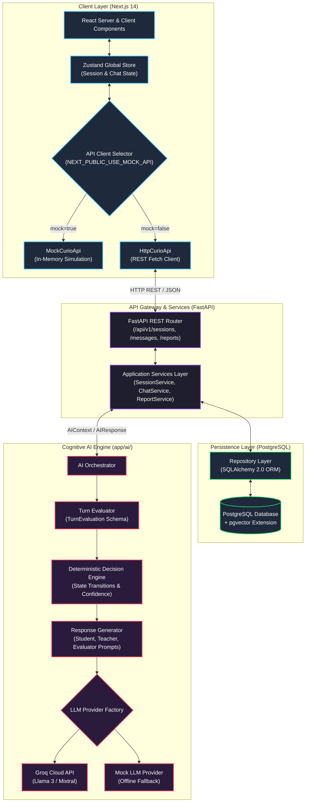
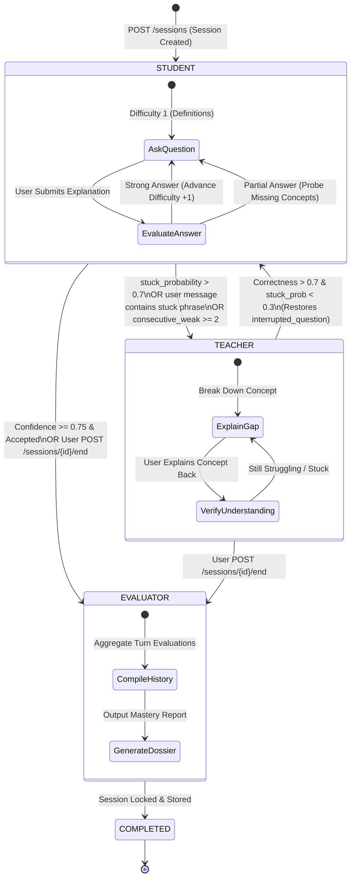
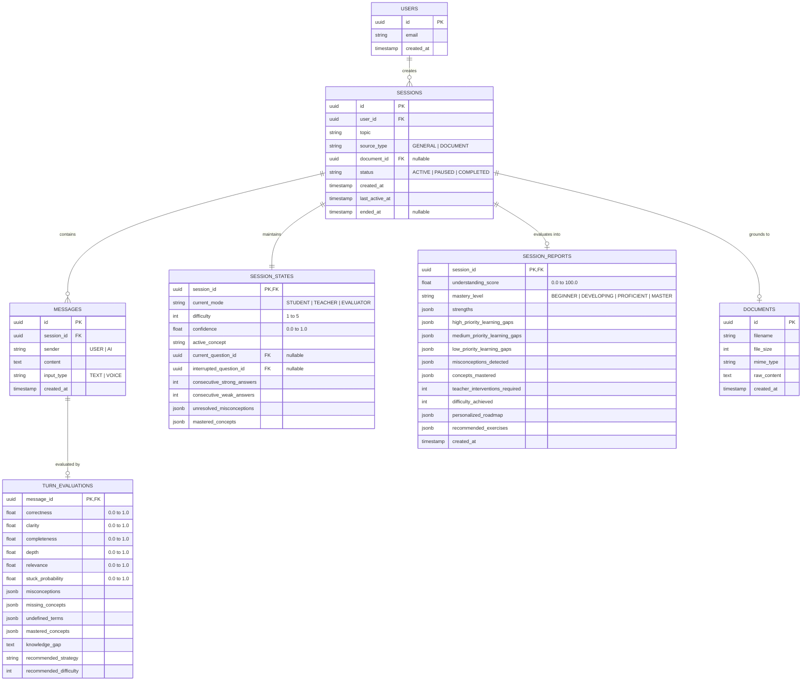

<div align="center">

# 🎭 Curio AI

### *Learn by Teaching — The Reverse-Tutor AI Platform Powered by the Feynman Technique*

[](LICENSE)
[](https://nextjs.org/)
[](https://fastapi.tiangolo.com/)
[](https://www.python.org/)
[](https://www.typescriptlang.org/)
[](https://tailwindcss.com/)
[](https://www.postgresql.org/)
[](https://groq.com/)
[](docker-compose.yml)
[](https://github.com/joshi-chinmay-016/Curio-AI/pulls)

<p align="center">
  <b>Most AI educational tools answer your questions. Curio AI makes you answer theirs.</b><br>
  <i>By reversing the conversational dynamic, Curio AI turns you into the teacher and the AI into an inquisitive, curious student—identifying your cognitive gaps, challenging vague definitions, and solidifying genuine comprehension.</i>
</p>

<p align="center">
  <a href="#-the-feynman-principle-why-curio-ai">The Feynman Principle</a> •
  <a href="#-interactive-session-walkthrough">Session Walkthrough</a> •
  <a href="#-core-features">Core Features</a> •
  <a href="#-system-architecture">System Architecture</a> •
  <a href="#-state-machine--deterministic-decision-engine">State Machine</a> •
  <a href="#-database-schema--entity-relationships">Database ERD</a> •
  <a href="#-tech-stack--architectural-rationale">Tech Stack</a> •
  <a href="#-repository-structure">Project Layout</a> •
  <a href="#-rest-api-reference">API Reference</a> •
  <a href="#-quickstart-guide">Quickstart</a> •
  <a href="#-code-ownership--team-boundaries">Code Ownership</a> •
  <a href="#-frequently-asked-questions">FAQ</a>
</p>

</div>

---

## 🎯 The Feynman Principle: Why Curio AI?

> [!IMPORTANT]
> **"If you want to master something, teach it. The ultimate test of your knowledge is your capacity to convey it to another."** — *Richard Feynman*

### The Problem: The "Illusion of Competence"
Traditional AI chatbots encourage **passive consumption**. When an LLM explains quantum computing or binary search trees, it produces articulate, perfectly structured answers. The reader nods along, experiencing the cognitive bias known as the *illusion of competence*—mistaking recognition for true understanding. The moment they are asked to implement or defend the concept without assistance, their knowledge breaks down.

### The Solution: The Reverse-Tutor Paradigm
Curio AI turns the traditional learning loop upside down:
1. **You Choose the Topic**: Pick any subject, or upload a textbook PDF or lecture notes.
2. **You Teach the Student**: Curio AI assumes the role of a curious, novice student with no prior assumptions.
3. **The AI Challenges You**: Curio AI asks foundational questions, probes edge cases, flags buzzwords, and tests trade-offs.
4. **Autonomous Role Reversal**: If you freeze, contradict yourself, or type *"I don't know"*, Curio switches into **Teacher Mode** to walk you through the missing mental model, then prompts you to explain it back before resuming the student persona.
5. **Comprehensive Diagnostic Report**: When the session concludes, you receive a full mastery audit with concept breakdowns, identified misconceptions, and an actionable learning roadmap.

```
┌─────────────────────────────────────────────────────────────────────────────┐
│                       TRADITIONAL AI CHATBOTS                               │
│      [User Asks Question]  ──▶  [AI Explains Answer]  ──▶  [Passive Nodding] │
│                         (Illusion of Understanding)                         │
└─────────────────────────────────────────────────────────────────────────────┘
                                      VS
┌─────────────────────────────────────────────────────────────────────────────┐
│                               CURIO AI                                      │
│      [AI Plays Student]    ──▶  [User Explains Topic] ──▶  [AI Probes Gaps] │
│      [Role Switch on Gap]  ──▶  [Active Recall Check] ──▶  [True Mastery]   │
└─────────────────────────────────────────────────────────────────────────────┘
```

---

## 🖥️ Interactive Session Walkthrough

Experience how Curio AI navigates a learning session across its three core operational modes:

### 1. 🧑‍🎓 Student Mode (Active Inquisitor)
*The AI acts as an inquisitive beginner seeking foundational clarity and real-world mechanisms.*

```text
┌───────────────────────────────────────────────────────────────────────────────────────────┐
│ CURIO AI [STUDENT MODE // DIFFICULTY 1]                                                   │
│ "I'm trying to learn Recursion! Can you explain to me what actually happens when a       │
│  function calls itself? How does it avoid repeating forever?"                             │
└───────────────────────────────────────────────────────────────────────────────────────────┘
                                              ▲
                                              │ USER RESPONSE
┌───────────────────────────────────────────────────────────────────────────────────────────┐
│ USER [TEACHER]                                                                            │
│ "A function calls itself with a smaller input, and it stops when it hits a base case."    │
└───────────────────────────────────────────────────────────────────────────────────────────┘
                                              ▼
┌───────────────────────────────────────────────────────────────────────────────────────────┐
│ CURIO AI [STUDENT MODE // DIFFICULTY 2 // EVALUATION: CORRECT=0.8, CLARITY=0.9]           │
│ "That makes sense! But what physically happens in the computer's memory while all those   │
│  calls are waiting for the base case to finish? What is the call stack doing?"            │
└───────────────────────────────────────────────────────────────────────────────────────────┘
```

---

### 2. 💡 Teacher Mode (Socratic Intervention)
*When the user becomes stuck or expresses uncertainty, the deterministic engine switches roles.*

```text
┌───────────────────────────────────────────────────────────────────────────────────────────┐
│ USER [TEACHER]                                                                            │
│ "Honestly, idk how stack frames work under the hood. I'm stuck."                          │
└───────────────────────────────────────────────────────────────────────────────────────────┘
                                              ▼
┌───────────────────────────────────────────────────────────────────────────────────────────┐
│ ⚠️ TRIGGER: stuck_probability=0.92 // is_stuck_phrase=True ──▶ TRANSITION TO TEACHER MODE │
│ Current question ID saved to `interrupted_question_id`.                                   │
└───────────────────────────────────────────────────────────────────────────────────────────┘
                                              ▼
┌───────────────────────────────────────────────────────────────────────────────────────────┐
│ CURIO AI [TEACHER MODE // EXPLAINING KNOWLEDGE GAP]                                       │
│ "No worries at all! Let's pause and break this down together.                             │
│                                                                                           │
│  Think of the call stack like a stack of cafeteria trays. Each time a function calls      │
│  itself, a new frame (tray) is pushed on top with its local variables. The computer      │
│  can only execute the tray at the very top. When the base case returns, trays are popped  │
│  off one by one. If you never hit a base case, you overflow the stack.                    │
│                                                                                           │
│  Now, to make sure this clicked: in your own words, what would cause a Stack Overflow     │
│  error in a recursive countdown function?"                                                │
└───────────────────────────────────────────────────────────────────────────────────────────┘
```

---

### 3. 📊 Evaluator Mode (Mastery Audit & Roadmap)
*Upon session completion, Curio synthesizes turn-by-turn telemetry into a rich performance dossier.*

```text
╔═══════════════════════════════════════════════════════════════════════════════════════════╗
║                               CURIO AI MASTERY DOSSIER                                    ║
╠═══════════════════════════════════════════════════════════════════════════════════════════╣
║  Topic: Recursion & Stack Frames                       Mastery Level: PROFICIENT          ║
║  Overall Understanding Score: 84%                      Max Difficulty Reached: 4 / 5      ║
║  Teacher Interventions: 1                              Confidence Rating: 0.81            ║
╠═══════════════════════════════════════════════════════════════════════════════════════════╣
║                                                                                           ║
║  CONCEPT COVERAGE RADAR:                                                                  ║
║  [████████████████████░░░░] 82% Core Definition & Self-Invocation                         ║
║  [████████████████████████] 100% Base Case & Termination Logic                            ║
║  [██████████████░░░░░░░░░░] 60% Stack Frame Lifecycle & Memory Overhead                   ║
║  [████████████████░░░░░░░░] 68% Tail Call Optimization & Iterative Equivalents            ║
║                                                                                           ║
║  ✅ MASTERED CONCEPTS:                                                                     ║
║     • Base Case Guard Clauses      • Call Stack LIFO Unwinding   • Divide-and-Conquer     ║
║                                                                                           ║
║  ⚠️ MISCONCEPTIONS RESOLVED:                                                              ║
║     • "Assumed recursive functions share the same local scope variables across calls"     ║
║                                                                                           ║
║  🗺️ PERSONALIZED ACTION PLAN:                                                             ║
║     1. Practice converting recursive Fibonacci to Tail-Call Optimized (TCO) syntax.       ║
║     2. Implement Depth-First Search (DFS) on a binary tree using an explicit stack.       ║
║                                                                                           ║
╚═══════════════════════════════════════════════════════════════════════════════════════════╝
```

---

## ✨ Core Features

| Feature | Description |
| :--- | :--- |
| **🔄 Reverse-Tutoring Interaction** | Flips standard AI education; user teaches the AI, forcing active recall and articulation. |
| **⚙️ Deterministic State Machine** | AI provider *does not* decide mode switches. A deterministic rule engine uses structured evaluation metrics to calculate state transitions safely. |
| **🛡️ DB-AI Architectural Isolation** | Zero coupling between database models and AI prompts; application services maintain a strict safety and validation boundary. |
| **⚡ Mock-First Architecture (ADR-001)** | Complete TypeScript client (`MockCurioApi`) simulates state machines and latency so frontend development never waits for backend services. |
| **📄 Grounded Document Tutoring (RAG)** | Upload lecture notes, syllabus chapters, or PDFs (`/documents`) to anchor Curio's curiosity to specific curricula. |
| **📈 Multi-Factor Confidence Metric** | Dynamically calculates user comprehension using a 5-factor weighted algorithm with penalization for misconceptions. |
| **🎚️ Adaptive Difficulty Scaling** | Automatically steps questions from level 1 (definitions) through level 5 (systemic trade-offs and edge cases). |
| **📊 Turn-by-Turn Telemetry** | Every response is evaluated for correctness, clarity, completeness, depth, and stuck probability. |

---

## 🏗️ System Architecture

Curio AI is engineered as a clean monorepo separating client presentation, REST orchestration, persistent storage, and cognitive reasoning.



### 🔒 The DB-AI Isolation Rule
To maintain codebase maintainability and ensure modular development:
- **No Database Imports in AI Engine**: Files inside `backend/app/ai/` must **never** import `sqlalchemy`, database sessions, or models from `backend/app/models/`.
- **Pure Functional Boundary**: The `ChatService` loads data from PostgreSQL, maps records into static Pydantic schemas (`AIContext`), invokes `orchestrator.step()`, and commits the output (`TurnEvaluation`, `LearningDecision`, `Message`) back to PostgreSQL.

---

## 🔄 State Machine & Deterministic Decision Engine

Curio AI does not permit the LLM to make state machine decisions, avoiding unpredictable mode thrashing and conversation drift. Instead, the LLM outputs a structured assessment (`TurnEvaluation`), and the **Deterministic Decision Engine** (`decision_engine.py`) transitions modes via mathematical rules.



### Decision Transition Matrix

| Current Mode | Trigger Condition | Next Mode | Next Strategy | Action / Side Effect |
| :--- | :--- | :--- | :--- | :--- |
| **`STUDENT`** | `stuck_probability > 0.7` or helper phrase (`"idk"`, `"can you explain"`) | **`TEACHER`** | `TEACH_GAP` | Stores active question in `interrupted_question_id`. |
| **`STUDENT`** | `misconceptions > 0` AND `consecutive_weak >= 1` | **`TEACHER`** | `TEACH_GAP` | Intervenes on repeated cognitive errors. |
| **`STUDENT`** | `correctness > 0.7` AND `consecutive_strong >= 2` | **`STUDENT`** | `INCREASE_DIFFICULTY` | Increments difficulty level (`min(5, difficulty + 1)`). |
| **`STUDENT`** | `correctness > 0.7` AND `consecutive_strong < 2` | **`STUDENT`** | `PROBE_WHY` | Probes deeper mechanism or nuance. |
| **`STUDENT`** | `correctness <= 0.7` | **`STUDENT`** | `PROBE_MISSING_CONCEPT` | Asks about unaddressed foundational criteria. |
| **`TEACHER`** | `correctness > 0.7` AND `stuck_probability < 0.3` | **`STUDENT`** | `RESTORE_INTERRUPTED_QUESTION` | Concept verified. Restores `interrupted_question_id`. |
| **`TEACHER`** | `correctness <= 0.7` OR `stuck_probability >= 0.3` | **`TEACHER`** | `VERIFY_UNDERSTANDING` | Retains Teacher mode; re-explains from a new angle. |
| **`STUDENT`** | `confidence >= 0.75` | **`STUDENT`** | `OFFER_TERMINATION` | Signals frontend to prompt user for session conclusion. |
| **ANY** | `POST /sessions/{id}/end` | **`EVALUATOR`** | `GENERATE_REPORT` | Compiles final dossier; status becomes `COMPLETED`. |

### Confidence Metric Mathematical Model
The user's mastery confidence score $C \in [0.0, 1.0]$ is computed deterministically per turn:

$$C = \sum (W_i \cdot M_i) - P_{\text{misconception}} - P_{\text{dependency}}$$

```python
CONFIDENCE_WEIGHTS = {
    "concept_coverage":       0.30,   # Percentage of foundational concepts explored
    "recent_answer_quality":  0.25,   # Correctness of latest explanation
    "difficulty_achievement": 0.20,   # Normalized current difficulty (level / 5.0)
    "consistency":            0.15,   # Ratio of strong vs weak responses
    "independent_correction": 0.10    # Successfully self-correcting without teacher aid
}

# Penalties:
# Misconception Penalty: -0.15 per active misconception
# Help Dependency Penalty: -0.20 while active in TEACHER mode
```

---

## 🗄️ Database Schema & Entity Relationships

The data model uses PostgreSQL with UUIDv4 primary keys, JSONB serialization for dynamic lists, and cascading relationship constraints.



---

## 🛠️ Tech Stack & Architectural Rationale

| Layer | Technology | Selection Rationale |
| :--- | :--- | :--- |
| **Frontend Framework** | **Next.js 14 (App Router)** | High-performance React framework with server-side layout caching and streamlined routing for dashboard and chat interfaces. |
| **UI Styling** | **Tailwind CSS** | Utility-first styling enabling rapid theme customization, responsive breakpoints, and modern dark-mode aesthetic. |
| **State Management** | **Zustand** | Minimalist, unopinionated client-side state store; avoids Context re-render cascades during live message streaming. |
| **Icons & Visuals** | **Lucide React** | Clean, consistent, lightweight SVG icon package. |
| **Backend Framework** | **FastAPI (Python 3.10+)** | Async native REST API with auto-generated OpenAPI/Swagger documentation, strict dependency injection, and native Pydantic validation. |
| **Data Validation** | **Pydantic v2** | High-speed C-based schema validation powering API payloads, database models, and LLM JSON generation contracts. |
| **ORM & Migrations** | **SQLAlchemy 2.0 + Alembic** | Robust relational mapper with declarative typing and predictable database schema version control. |
| **Database** | **PostgreSQL + pgvector** | Battle-tested relational database with native JSONB querying and vector similarity search readiness for RAG knowledge grounding. |
| **LLM Inference** | **Groq Cloud API** | Ultra-low latency Llama-3-70b / Mixtral inference (500+ tokens/sec) providing instant, human-like student responses. |
| **Containerization** | **Docker & Docker Compose** | Reproducible multi-service deployment orchestrating PostgreSQL with pgvector, FastAPI, and local environment isolation. |

---

## 📂 Repository Structure

```text
Curio-AI/
├── .env.example                     # Unified environment variable template
├── .github/
│   ├── pull_request_template.md     # Mandatory PR checklist (contracts, migrations)
│   └── workflows/
│       └── ci.yml                   # GitHub Actions pipeline (test, lint, build)
├── docker-compose.yml               # PostgreSQL + pgvector and backend orchestrator
├── Dockerfile                       # Production container build for FastAPI service
├── Readme.md                        # Project documentation (this file)
│
├── backend/                         # FastAPI Backend Application (Owner: Vishal)
│   ├── requirements.txt             # Python production dependencies
│   ├── alembic/                     # Database migrations
│   ├── app/
│   │   ├── main.py                  # Application factory, CORS, exception handlers
│   │   ├── core/                    # App settings, logging, custom exceptions
│   │   ├── db/                      # SQLAlchemy session lifecycle, base model
│   │   ├── models/                  # Relational database models (User, Session, Message)
│   │   ├── schemas/                 # API request & response Pydantic contracts
│   │   ├── repositories/            # Data access objects (CRUD operations)
│   │   ├── services/                # Business logic boundary (DB ⇄ AI mapping)
│   │   ├── api/
│   │   │   ├── router.py            # API v1 route aggregator
│   │   │   └── v1/                  # Endpoints (sessions, messages, reports, docs)
│   │   └── ai/                      # Cognitive AI Engine (Owner: Chinmay)
│   │       ├── orchestrator.py      # Core execution loop
│   │       ├── evaluator.py         # Response analysis & TurnEvaluation generator
│   │       ├── decision_engine.py   # Deterministic mode transitions & strategies
│   │       ├── confidence.py        # Weighted multi-factor mastery calculation
│   │       ├── student.py           # Student question generation prompt logic
│   │       ├── teacher.py           # Teacher gap explanation prompt logic
│   │       ├── evaluator_mode.py    # Final evaluation & report synthesizer
│   │       ├── schemas.py           # Internal AI Pydantic data schemas
│   │       ├── providers/           # LLM drivers (GroqProvider, MockProvider)
│   │       └── rag/                 # Document ingestion & semantic retrieval
│   └── tests/                       # Unit & integration test suite
│       ├── ai/                      # Decision engine & confidence unit tests
│       └── api/                     # REST health & session integration tests
│
├── frontend/                        # Next.js 14 Application (Owner: Chinmay)
│   ├── package.json                 # Node dependencies (Next.js, Tailwind, Zustand)
│   ├── tsconfig.json                # TypeScript compiler configuration
│   ├── tailwind.config.js           # Design tokens and theme styling
│   ├── app/
│   │   ├── layout.tsx               # Root application shell & metadata
│   │   ├── page.tsx                 # Primary dashboard layout
│   │   └── globals.css              # Global styles & Tailwind directives
│   ├── components/
│   │   ├── chat/                    # Chat container, message bubbles, input bar
│   │   ├── reports/                 # Evaluation report card & mastery radar
│   │   ├── sessions/                # Sidebar session history & lifecycle controls
│   │   └── topic/                   # Topic initiator & document upload modal
│   ├── stores/                      # Zustand global state (session-store.ts)
│   ├── types/                       # TypeScript interfaces mirroring API contracts
│   └── lib/api/                     # Client adapters (MockCurioApi, HttpCurioApi)
│
├── contracts/                       # Shared Single Source of Truth
│   ├── api-contract.md              # REST endpoints schema contract
│   ├── ai-contract.md               # AI Engine internal schemas contract
│   ├── events-contract.md           # Real-time WebSocket / SSE telemetry specs
│   └── examples/                    # JSON mock payloads for rapid testing
│
├── docs/                            # Deep Technical Documentation
│   ├── architecture.md              # High-level architecture & component flow
│   ├── state-machine.md             # Mode transitions & deterministic rules
│   ├── database.md                  # Database schema & indexing strategy
│   ├── ownership.md                 # Code ownership matrix & developer boundaries
│   ├── development-workflow.md      # Git conventions & contract change protocol
│   └── adr/
│       └── adr-001-mock-first-api.md # ADR: Mock-first frontend development
│
└── scripts/                         # Automation & Developer Tooling
    ├── setup.ps1                    # PowerShell full-environment bootstrapper
    └── setup.sh                     # Bash full-environment bootstrapper
```

---

## 📡 REST API Reference

The FastAPI service exposes a strictly typed REST interface documented via OpenAPI at `http://localhost:8000/docs`.

### Session Endpoints

| Method | Endpoint | Description | Status Code |
| :--- | :--- | :--- | :--- |
| `GET` | `/health` | API & Database health check | `200 OK` |
| `POST` | `/api/v1/sessions` | Create a new learning session for a topic | `201 Created` |
| `GET` | `/api/v1/sessions` | List all historical and active sessions | `200 OK` |
| `GET` | `/api/v1/sessions/{id}` | Retrieve complete session metadata and state | `200 OK` |
| `PATCH` | `/api/v1/sessions/{id}` | Update session configurations (rename topic) | `200 OK` |
| `DELETE`| `/api/v1/sessions/{id}` | Delete session and cascade delete all messages | `204 No Content` |
| `POST` | `/api/v1/sessions/{id}/pause` | Pause an active learning session | `200 OK` |
| `POST` | `/api/v1/sessions/{id}/resume`| Resume a paused learning session | `200 OK` |
| `POST` | `/api/v1/sessions/{id}/end` | Lock session and trigger `EVALUATOR` report | `200 OK` |

### Interaction & Report Endpoints

| Method | Endpoint | Description | Status Code |
| :--- | :--- | :--- | :--- |
| `POST` | `/api/v1/sessions/{id}/messages` | Submit teacher response; executes evaluation step | `200 OK` |
| `GET` | `/api/v1/sessions/{id}/messages` | Retrieve chronological message logs | `200 OK` |
| `GET` | `/api/v1/sessions/{id}/report` | Retrieve compiled mastery dossier (requires ended session) | `200 OK` |
| `POST` | `/api/v1/documents` | Upload PDF or text file for grounded session context | `201 Created` |
| `GET` | `/api/v1/documents/{id}` | Retrieve uploaded document metadata | `200 OK` |

#### Example: Send Message Payload (`POST /api/v1/sessions/{id}/messages`)
```json
{
  "content": "In recursion, each function call pushes a new frame onto the stack with its local variables.",
  "input_type": "TEXT"
}
```

#### Example: Response Payload
```json
{
  "user_message": {
    "message_id": "43956417-743a-4467-bc18-974fe0fb7891",
    "sender": "USER",
    "content": "In recursion, each function call pushes a new frame onto the stack with its local variables."
  },
  "ai_message": {
    "message_id": "b18f090c-be4e-4b47-ae86-5384617a2a07",
    "sender": "AI",
    "content": "That makes sense! So what happens to those frames once the base case is reached?"
  },
  "evaluation": {
    "correctness": 0.9,
    "clarity": 0.85,
    "completeness": 0.7,
    "depth": 0.65,
    "stuck_probability": 0.0,
    "misconceptions": [],
    "mastered_concepts": ["Call Stack", "Stack Frames"]
  },
  "decision": {
    "next_mode": "STUDENT",
    "strategy": "PROBE_WHY",
    "difficulty": 2,
    "confidence": 0.48,
    "should_offer_termination": false
  }
}
```

---

## 🚀 Quickstart Guide

Get Curio AI running on your local machine in minutes.

### Prerequisites
- **Node.js**: v18.0.0 or higher
- **Python**: v3.10 or higher
- **Docker & Docker Compose**: (Recommended for PostgreSQL)
- **Groq API Key**: (Optional: only needed for live LLM generation; mock mode works out of the box)

---

### Step 1: Clone and Configure Environment
```bash
# Clone the repository
git clone https://github.com/joshi-chinmay-016/Curio-AI.git
cd Curio-AI

# Create your local environment file
cp .env.example .env
```

*Optionally edit `.env` to supply your Groq API key if you want live inference:*
```env
GROQ_API_KEY=gsk_your_groq_api_key_here
```

---

### Step 2: Automated Bootstrap (Recommended)

Run the bootstrap script for your operating system:

**On Windows (PowerShell):**
```powershell
.\scripts\setup.ps1
```

**On Linux / macOS (Bash):**
```bash
chmod +x ./scripts/setup.sh
./scripts/setup.sh
```

---

### Step 3: Run the Application

You can run Curio AI in two ways:

#### Option A: Frontend Mock Mode (Zero Backend Required)
*Ideal for UI development, designing state machines, and styling without starting Python or Docker.*
1. Ensure `NEXT_PUBLIC_USE_MOCK_API=true` in `.env`.
2. Start the Next.js dev server:
   ```bash
   cd frontend
   npm run dev
   ```
3. Open [http://localhost:3000](http://localhost:3000) in your browser. All API interactions will execute via `MockCurioApi` in client memory!

---

#### Option B: Full-Stack Local Development (Real Backend + DB)

**Terminal 1 — Start the Database:**
```bash
docker-compose up db -d
```

**Terminal 2 — Start the FastAPI Backend:**
```bash
cd backend

# On Linux / macOS:
source venv/bin/activate

# On Windows:
.\venv\Scripts\activate

# Launch the API server:
uvicorn backend.app.main:app --reload --port 8000
```
*API interactive documentation will be live at [http://localhost:8000/docs](http://localhost:8000/docs).*

**Terminal 3 — Start the Next.js Frontend:**
```bash
cd frontend

# Set mock mode to false in your .env:
# NEXT_PUBLIC_USE_MOCK_API=false

npm run dev
```
*Frontend UI will be live at [http://localhost:3000](http://localhost:3000).*

---

#### Option C: Full Containerized Stack (Docker Compose)
Run the entire environment via Docker:
```bash
docker-compose up --build
```

---

## ⚙️ Environment Configuration

| Variable | Default Value | Service | Description |
| :--- | :--- | :--- | :--- |
| `PROJECT_NAME` | `"Curio AI"` | Backend | Display name of the application. |
| `POSTGRES_SERVER` | `localhost` | Backend | Database host address. |
| `POSTGRES_PORT` | `5432` | Backend | Database port. |
| `POSTGRES_USER` | `postgres` | Backend | Database superuser account. |
| `POSTGRES_PASSWORD` | `postgres` | Backend | Database password. |
| `POSTGRES_DB` | `curio_db` | Backend | PostgreSQL database name. |
| `DATABASE_URL` | *(derived)* | Backend | Full SQLAlchemy connection URI (`postgresql://...`). |
| `GROQ_API_KEY` | *(empty)* | Backend / AI | Groq Cloud API key for high-speed Llama 3 generation. |
| `NEXT_PUBLIC_USE_MOCK_API` | `true` | Frontend | When `true`, routes all UI actions to `MockCurioApi`. |
| `NEXT_PUBLIC_API_URL` | `http://localhost:8000/api/v1` | Frontend | Base URL for FastAPI backend endpoints. |

---

## 👥 Code Ownership & Team Boundaries

To maximize developer velocity, Curio AI enforces clear architectural ownership boundaries:

| Component / Subpath | Primary Owner | Architectural Responsibilities |
| :--- | :--- | :--- |
| `frontend/` | **Chinmay Joshi** | Next.js app, Zustand stores, responsive Tailwind styling, UI components. |
| `backend/app/ai/` | **Chinmay Joshi** | Prompt engineering, evaluator schemas, state machine decision engine, LLM providers. |
| `backend/app/api/` | **Vishal S Naik** | FastAPI routes, input validation, error handling, route registration. |
| `backend/app/models/` | **Vishal S Naik** | SQLAlchemy ORM entity models, foreign keys, cascading configurations. |
| `backend/app/repositories/` | **Vishal S Naik** | Database access objects, CRUD queries, index optimization. |
| `backend/app/services/` | **Vishal S Naik** | Orchestration layer; maps DB entities to `AIContext` schemas and commits outputs. |
| `backend/app/db/` & `alembic/`| **Vishal S Naik** | Database connection pooling, Alembic migration scripts. |
| `contracts/` & `docs/` | **Shared** | API endpoints, LLM JSON contracts, architectural decision records. |

### Development & Branch Conventions
- **Vishal**: Use `feat/backend-*` or `fix/backend-*` (e.g., `feat/backend-session-api`)
- **Chinmay**: Use `feat/frontend-*` or `feat/ai-*` (e.g., `feat/ai-evaluator-engine`)
- **Contract Changes**: Any modifications to files in `contracts/` require formal review and approval from both team members before implementation.

---

## 🧪 Testing & Quality Assurance

### Backend Unit & Integration Tests
Curio AI includes test suites for the decision engine, state transitions, confidence calculations, and REST API health:

```bash
cd backend
source venv/bin/activate  # Or .\venv\Scripts\activate on Windows

# Run all test suites
pytest

# Run tests with verbose output
pytest -v -s backend/tests/ai/test_decision_engine.py
```

### Frontend Linting & Type Checking
```bash
cd frontend

# Verify TypeScript type correctness
npm run build

# Run ESLint validation
npm run lint
```

---

## 🗺️ Project Roadmap

- [x] **Phase 1: Architecture & Monorepo Foundation**
  - [x] End-to-end monorepo scaffolding with FastAPI & Next.js 14
  - [x] Strict API contract specifications (`contracts/api-contract.md`)
  - [x] In-memory mock API client (`MockCurioApi`) for decoupled UI development
  - [x] Deterministic state machine with weighted confidence calculations
- [ ] **Phase 2: Live AI Integration & Persistence**
  - [x] PostgreSQL relational schema with JSONB array storage
  - [x] Groq API integration (Llama 3 70B & Mixtral 8x7B)
  - [ ] Alembic automated migration pipeline
  - [ ] Server-Sent Events (SSE) for streaming student questioning
- [ ] **Phase 3: Multimodal & Grounded Tutoring**
  - [ ] PDF document ingestion with pgvector semantic chunk retrieval (RAG)
  - [ ] Real-time voice-to-voice interaction (WebRTC + Whisper speech-to-text)
  - [ ] Interactive whiteboard canvas where the user can sketch architectural diagrams
- [ ] **Phase 4: Classroom & Team Analytics**
  - [ ] Professor dashboard tracking cohort knowledge blindspots
  - [ ] Exportable competency certificates based on verifiable mastery dossiers

---

## ❓ Frequently Asked Questions

<details>
<summary><b>1. How does Curio AI differ from just asking ChatGPT to "quiz me"?</b></summary>
<br>
Standard LLMs tend to be sycophantic; they readily accept vague user answers, validate hallucinations, and struggle to stay in a strict pedagogical role. Curio AI separates <b>evaluation</b> from <b>conversation</b>. A dedicated, structured evaluator inspects your answer for undefined terms, missing concepts, and stuck probability. Then, a <b>deterministic decision engine</b> controls mode switching—ensuring the AI cannot hallucinate out of its student persona unless mathematically justified.
</details>

<details>
<summary><b>2. Do I need an expensive GPU or API key to try Curio AI locally?</b></summary>
<br>
Not at all! Curio AI is built with an <b>ADR-001 Mock-First Architecture</b>. With <code>NEXT_PUBLIC_USE_MOCK_API=true</code>, the entire Next.js frontend runs offline in your browser using simulated responses, mock state transitions, and instant feedback. To use real AI on the backend, Groq provides a generous free tier with high inference speeds.
</details>

<details>
<summary><b>3. Why is the state machine deterministic rather than LLM-directed?</b></summary>
<br>
Prompting an LLM to decide when to change modes causes unpredictable state flips, circular questioning, and conversational drift. By extracting evaluation metrics (e.g., <code>stuck_probability</code>, <code>correctness</code>) into typed Pydantic models, our deterministic engine applies predictable, battle-tested pedagogical rules to decide state transitions.
</details>

<details>
<summary><b>4. How does Curio AI avoid database queries inside AI prompt modules?</b></summary>
<br>
Through our <b>DB-AI Isolation Rule</b>. The AI engine (<code>backend/app/ai/</code>) is purely functional; it only accepts <code>AIContext</code> Pydantic models and emits <code>AIResponse</code> schemas. The <code>ChatService</code> layer handles all database reads, mapping, and database writes.
</details>

---

## 🤝 Contributing

Contributions make the open-source community an exceptional space to learn, inspire, and create. Any contributions you make are **greatly appreciated**.

1. Fork the Project
2. Create your Feature Branch (`git checkout -b feat/amazing-feature`)
3. Commit your Changes (`git commit -m 'feat: add amazing feature'`)
4. Push to the Branch (`git push origin feat/amazing-feature`)
5. Open a Pull Request

Please ensure your changes conform to the existing conventions in `docs/development-workflow.md` and pass all `pytest` and `npm run lint` checks.

---

## 📜 License

Distributed under the **MIT License**. See `LICENSE` for more information.

<div align="center">

---

**Built with ❤️ by Chinmay Joshi & Vishal S Naik**<br>
*Reversing the learning loop to help the world master deep concepts through the art of teaching.*

[⭐ Star on GitHub](https://github.com/joshi-chinmay-016/Curio-AI) • [🐛 Report a Bug](https://github.com/joshi-chinmay-016/Curio-AI/issues) • [💡 Request a Feature](https://github.com/joshi-chinmay-016/Curio-AI/issues)

</div>
