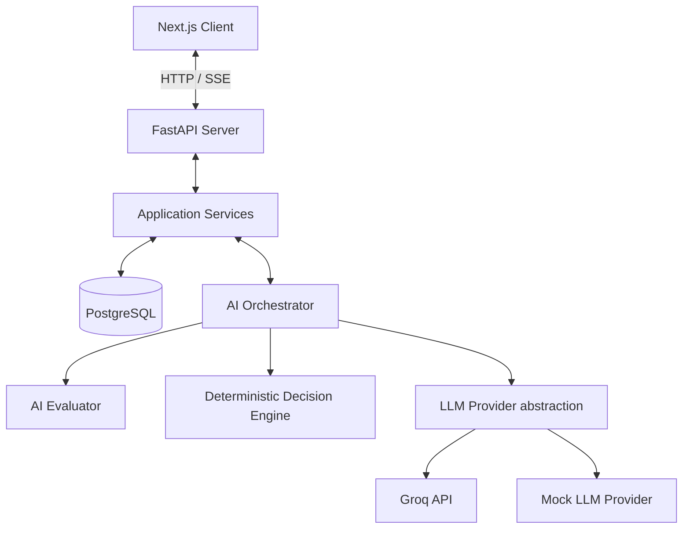

# System Architecture

This document describes the high-level architecture of Curio AI, outlining the roles of the frontend, backend, database, AI engine, and data flow.

## High-Level Architecture Diagram

## Core Components

### 1. Frontend (Next.js)
- Built with React, TypeScript, and Tailwind CSS.
- **Mocking Strategy**: A local TypeScript client `MockCurioApi` is provided so that UI layouts, sidebars, page routing, and state machine interactions can be fully tested in the browser without having a running Python server. Set `NEXT_PUBLIC_USE_MOCK_API=true` in `.env` to enable it.
- **Global State**: Next.js state is kept in Zustand stores to track active sessions, sidebar listings, and immediate UI settings.

### 2. Backend (FastAPI)
- Exposes REST endpoints to manage session lifecycles, messages, reports, and documents.
- Uses dependency injection to supply database sessions and service class instances.
- Standardizes error responses using custom exception handlers.

### 3. Application Services
- Orchestrates business transactions (loading history, managing session state, initiating the AI engine steps, and committing records to the DB).
- Acts as the safety boundary: **No AI prompt templates or LLM provider calls should exist in this service layer. Likewise, no database SQL queries should exist in the AI engine.**

### 4. AI Engine
- **Evaluator**: Judges the semantic quality of user responses (relevance, correctness, completeness, clarity, stuck probability) and outputs a structured Pydantic `TurnEvaluation`.
- **Deterministic Decision Engine**: Examines the latest evaluation along with the historical state metrics to compute mode transitions and parameter adjustments, producing a `LearningDecision`.
- **Response Generator**: Assembles prompts (Student questioning, Teacher gap explanations, or Evaluator reports) and sends them to the configured LLM provider.

### 5. Persistence (SQLAlchemy & PostgreSQL)
- Stores session details, message histories, evaluations, and compiled reports.
- Includes table indexes on foreign keys to optimize query performance when loading conversation history.
- Leverages Alembic for executing structured DB schema migrations.
