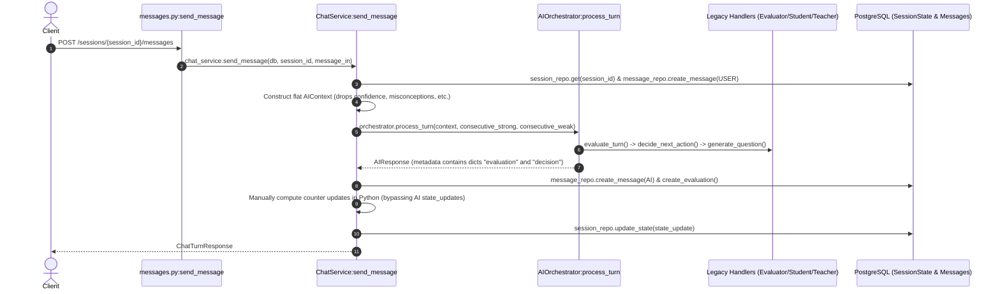

# Audit Report: ChatService AI Engine Integration

## 1. Executive Summary

This audit evaluates whether the Curio AI backend's `ChatService` integrates with the canonical, LangGraph-backed `CurioEngine.process()` or continues to invoke the legacy `AIOrchestrator`.

### Key Finding:
> **`ChatService` currently uses the legacy `AIOrchestrator` and completely bypasses `CurioEngine.process()`.**
> 
> As a result, PR #1's LangGraph compiled state machine ([backend/app/ai/graph.py](file:///c:/Users/Vishal%20S%20Naik/MyProjects/Curio-AI/backend/app/ai/graph.py)) and the canonical architectural boundary ([backend/app/ai/engine.py](file:///c:/Users/Vishal%20S%20Naik/MyProjects/Curio-AI/backend/app/ai/engine.py)) are never executed during production message processing.

---

## 2. Exact Files and Methods Involved

| File | Component / Method | Role in Execution |
| :--- | :--- | :--- |
| **[backend/app/api/v1/messages.py](file:///c:/Users/Vishal%20S%20Naik/MyProjects/Curio-AI/backend/app/api/v1/messages.py)** | `send_message()` | Entry point for `POST /sessions/{session_id}/messages`; delegates turn execution to `ChatService.send_message`. |
| **[backend/app/services/chat_service.py](file:///c:/Users/Vishal%20S%20Naik/MyProjects/Curio-AI/backend/app/services/chat_service.py)** | `ChatService.__init__()` | Instantiates legacy `self.orchestrator = AIOrchestrator(self.ai_provider)`. |
| **[backend/app/services/chat_service.py](file:///c:/Users/Vishal%20S%20Naik/MyProjects/Curio-AI/backend/app/services/chat_service.py)** | `ChatService.send_message()` | Coordinates DB lookup, `AIContext` compilation, AI turn invocation, and DB state updates. |
| **[backend/app/ai/orchestrator.py](file:///c:/Users/Vishal%20S%20Naik/MyProjects/Curio-AI/backend/app/ai/orchestrator.py)** | `AIOrchestrator.process_turn()` | Legacy AI controller directly invoking legacy sub-handlers (`AIEvaluator`, `StudentModeHandler`, `TeacherModeHandler`). |
| **[backend/app/ai/engine.py](file:///c:/Users/Vishal%20S%20Naik/MyProjects/Curio-AI/backend/app/ai/engine.py)** | `CurioEngine.process()` | Canonical AI Engine interface that encapsulates LangGraph (currently unused in runtime). |
| **[backend/app/repositories/session_repository.py](file:///c:/Users/Vishal%20S%20Naik/MyProjects/Curio-AI/backend/app/repositories/session_repository.py)** | `SessionRepository.update_state()` | Persists mutated session state (`SessionStateBase`) into PostgreSQL. |
| **[backend/app/repositories/message_repository.py](file:///c:/Users/Vishal%20S%20Naik/MyProjects/Curio-AI/backend/app/repositories/message_repository.py)** | `create_message()`, `create_evaluation()` | Persists user/AI chat messages and turn evaluation records. |

---

## 3. Current Execution Flow

When a user posts a message via `POST /api/v1/sessions/{session_id}/messages`:



### Trace Details:
1. **Load Session State**: Reads `db_session = self.session_repo.get(db, session_id)`.
2. **Persist User Message**: Inserts the incoming user message into the database.
3. **Compile AI Context**: Gathers recent message history and builds `AIContext` using flat legacy arguments (`session_id`, `topic`, `current_mode`, `difficulty`, `active_concept`, `current_question`, `history`).
4. **Invoke Legacy Orchestrator**: Calls `self.orchestrator.process_turn(context, consecutive_strong=..., consecutive_weak=...)`.
5. **Extract Unstructured Metadata**: Reads raw dictionaries `ai_response.metadata["evaluation"]` and `ai_response.metadata["decision"]`.
6. **Persist Records**: Saves AI message text and turn evaluation scores to DB.
7. **Ad-Hoc State Mutation**: Calculates consecutive answer streaks and concatenated concept lists in Python within `ChatService`, then calls `session_repo.update_state()`.
8. **Return Response**: Serializes into `ChatTurnResponse`.

---

## 4. Confirmed Integration Mismatches

### Mismatch A: `ChatService` Bypasses `CurioEngine` (Contract Rule #5)
- **Observed Reality**: Line 19 initializes `self.orchestrator = AIOrchestrator(self.ai_provider)` and line 64 calls `self.orchestrator.process_turn(...)`.
- **Contract Specification**: Section 2 & 9 of [docs/ai-contract.md](file:///c:/Users/Vishal%20S%20Naik/MyProjects/Curio-AI/docs/ai-contract.md) establishes `CurioEngine.process()` as the **exclusive** public interface. The LangGraph state machine is never run in production.

### Mismatch B: Discarding `AIResult` & `StateUpdates` (Contract Rule #4)
- **Observed Reality**: `ChatService` discards strongly-typed contracts and parses `ai_response.metadata["evaluation"]` and `ai_response.metadata["decision"]`. It then executes ad-hoc counter mutations:
  ```python
  if evaluation_data["correctness"] > 0.7:
      consecutive_strong += 1
  ```
- **Contract Specification**: The AI Engine returns `AIResult` containing `state_updates: StateUpdates`. Under Contract Rule #4 (*"AI Recommends, Backend Persists"*), the backend should apply `AIResult.state_updates` directly rather than re-computing pedagogical state changes.

### Mismatch C: Dropped Context Fields
| Field in DB / AI Contract | Current Behavior in `ChatService.send_message()` (Lines 51–61) | Impact |
| :--- | :--- | :--- |
| **`confidence`** (`understanding_confidence`) | **Omitted** from `AIContext` instantiation. The flat adapter defaults `understanding_confidence` to `0.0`. | The AI has zero memory of learner mastery; mastery-based mode transitions and termination logic (`confidence >= 0.75`) never trigger. |
| **`unresolved_misconceptions`** | **Omitted** from `AIContext`. `learning_context` defaults to an empty list. | Active misconceptions recorded in PostgreSQL are invisible to the AI, risking repeated pedagogical loops. |
| **`mastered_concepts`** | **Omitted** from `AIContext`. `learning_context` defaults to an empty list. | The AI repeatedly probes already-mastered concepts. |
| **`interrupted_question`** | **Hardcoded to `None`** (`interrupted_question=None`). | When switching from Teacher Mode back to Student Mode, the paused question cannot be restored. |
| **`current_question`** | Passed as an arbitrary `str` extracted from recent message history rather than a structured `CurrentQuestion`. | Concept and difficulty metadata tied to the active question are lost. |

---

## 5. Recommended Backend Changes

To synchronize `ChatService` with the Phase 0 AI Contract without breaking existing database tables:

### 1. Replace `AIOrchestrator` with `CurioEngine` in `ChatService`:
```python
# backend/app/services/chat_service.py
from backend.app.ai.engine import CurioEngine

class ChatService:
    def __init__(self):
        self.session_repo = SessionRepository()
        self.message_repo = MessageRepository()
        self.ai_engine = CurioEngine()  # Encapsulates compiled LangGraph
```

### 2. Construct Canonical Nested `AIContext`:
Populate all fields from `db_session.state` into `AIContext`:
```python
context = AIContext(
    session=SessionInfo(
        session_id=str(session_id),
        topic=db_session.topic,
        source_mode=SourceMode(db_session.source_type)
    ),
    current_state=SessionState(
        session_id=str(session_id),
        current_mode=Mode(db_session.state.current_mode),
        current_difficulty=db_session.state.difficulty,
        understanding_confidence=db_session.state.confidence,
        active_concept=db_session.state.active_concept,
        current_question=CurrentQuestion(
            id=str(db_session.state.current_question_id or ""),
            content=active_question,
            concept=db_session.state.active_concept,
            difficulty=db_session.state.difficulty,
        ) if active_question else None,
        interrupted_question=interrupted_question_obj,
        consecutive_successes=db_session.state.consecutive_strong_answers,
        consecutive_failures=db_session.state.consecutive_weak_answers,
        unresolved_misconceptions=db_session.state.unresolved_misconceptions or [],
    ),
    conversation=ConversationContext(recent_messages=ai_history),
    learning_context=LearningContext(
        mastered_concepts=db_session.state.mastered_concepts or [],
        unresolved_misconceptions=db_session.state.unresolved_misconceptions or [],
    )
)
```

### 3. Consume `AIResult.state_updates` for Database Persistence:
Replace ad-hoc counter math with updates emitted by `ai_result.state_updates`:
```python
ai_result: AIResult = self.ai_engine.process(context)

# Apply state mutations recommended by the AI Engine
updates = ai_result.state_updates
state_update = SessionStateBase(
    current_mode=LearningMode(updates.current_mode.value if updates.current_mode else db_session.state.current_mode),
    difficulty=updates.difficulty or db_session.state.difficulty,
    confidence=updates.confidence if updates.confidence is not None else db_session.state.confidence,
    active_concept=updates.active_concept or db_session.state.active_concept,
    current_question_id=ai_msg.id,
    interrupted_question_id=...,
    consecutive_strong_answers=...,
    consecutive_weak_answers=...,
    unresolved_misconceptions=updates.unresolved_misconceptions or db_session.state.unresolved_misconceptions,
    mastered_concepts=updates.mastered_concepts or db_session.state.mastered_concepts,
)
self.session_repo.update_state(db, session_id, state_update)
```

---

## 6. Relevant Tests to Add or Update

Currently, there are **no existing unit or integration tests** for `ChatService` or message processing in `backend/tests/`:

1. **New Unit Test (`backend/tests/services/test_chat_service.py`)**:
   - Verify `ChatService.send_message()` initializes and invokes `CurioEngine.process()`.
   - Assert that `understanding_confidence`, `unresolved_misconceptions`, `mastered_concepts`, and `interrupted_question` are correctly translated from `db_session.state` into the `AIContext` passed to `CurioEngine`.
   - Verify that `SessionStateBase` persisted in `SessionRepository.update_state` is driven by `AIResult.state_updates`.

2. **New API Integration Test (`backend/tests/api/test_messages.py`)**:
   - Send `POST /api/v1/sessions/{session_id}/messages` and assert that HTTP response returns valid `ChatTurnResponse` matching `AIResult`.
   - Verify subsequent turns retain updated confidence and mastered concepts across turns.
