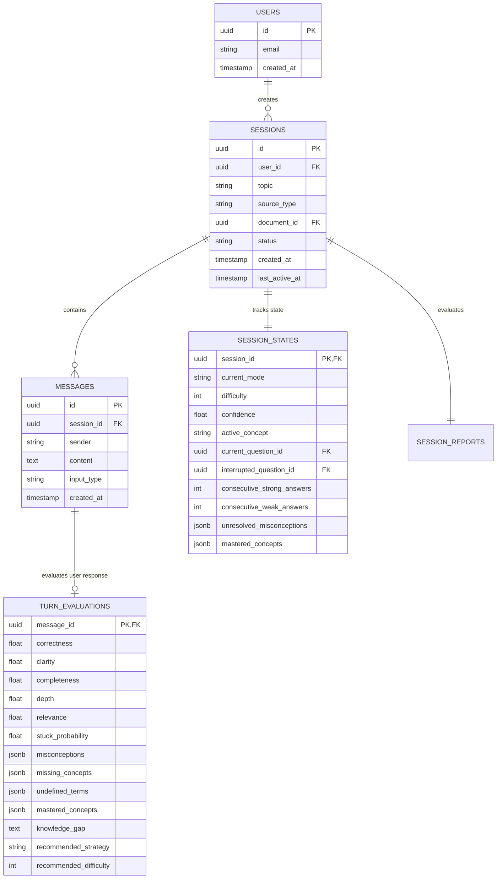

# Database Schema & Persistence Design

This document details the database models used for Curio AI sessions, messages, and evaluations.

## Entity Relationship Diagram

## Key Databases Practices

1. **UUID Keys**: All models use UUIDv4 for IDs. This makes it safe to reference IDs on the client side before they are fully persisted, facilitating mock compatibility.
2. **Strict Message Sequencing**: Messages are ordered using a timestamp or an autoincrementing integer. We index `session_id` and `created_at` on the `messages` table to ensure fast history retrieval.
3. **JSONB Serialization**: Lists (such as `misconceptions` or `mastered_concepts`) are stored in PostgreSQL using `JSONB` columns, avoiding the overhead of creating separate child tables for simple array attributes in the MVP.
4. **Foreign Key Constraints**: Delete actions on sessions cascade down to messages, session states, turn evaluations, and reports.
