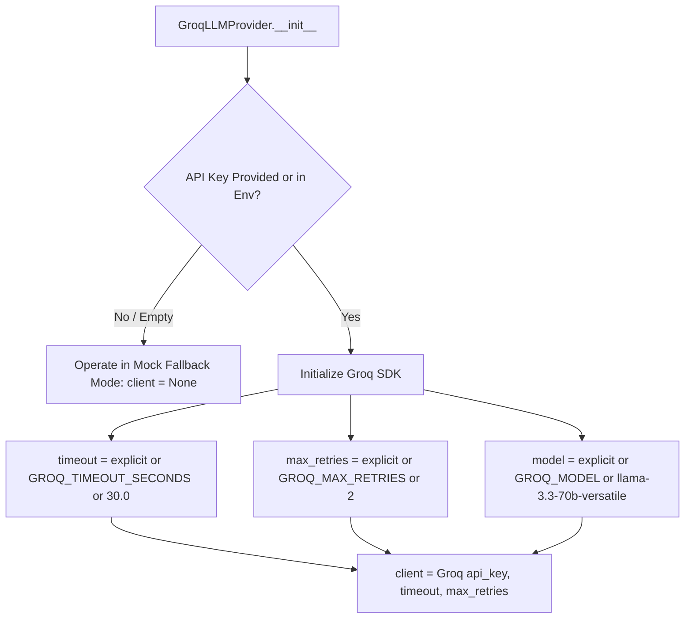

# Phase 1, Task 4C: Groq Provider Configuration and Reliability Implementation Report

**Date**: 2026-09-21  
**Author**: Backend Infrastructure Engineer (Pair Programming with AI Assistant)  
**Objective**: Implement production configuration, timeout safeguards, bounded retries, credential log sanitization, and model corrections for `GroqLLMProvider` while preserving fallback safety and the canonical `AIContext → CurioEngine → AIResult` contract.

---

## 1. Executive Summary

During the Phase 1, Task 4B audit ([`docs/phase-1-task-4b-live-llm-provider-integration-audit-report.md`](file:///c:/Users/Vishal%20S%20Naik/MyProjects/Curio-AI/docs/phase-1-task-4b-live-llm-provider-integration-audit-report.md)), we identified that `GroqLLMProvider` hardcoded a non-existent Groq model identifier (`"openai/gpt-oss-120b"`), lacked request timeout configuration, lacked bounded retry settings, and lacked key redaction in exception logs.

In Task 4C, these reliability and configuration requirements were implemented cleanly within strict architectural boundaries:
- **Zero AI Modifications**: No prompts, heuristics, LangGraph nodes, or decision rules were touched.
- **Contract Preserved**: The canonical `AIContext → CurioEngine.process() → AIResult` contract was strictly maintained.
- **Valid Production Model**: Replaced hardcoded invalid model with `llama-3.3-70b-versatile` (or configurable via `GROQ_MODEL`).
- **Timeout & Retries**: Added client-level and per-request timeouts (default `30.0s`) and bounded retries (`max_retries=2`) to eliminate thread-hanging risks.
- **Key & Log Sanitization**: Added automatic error message redaction ensuring API keys never appear in log files.
- **Mock Fallback Resilience**: 100% preserved graceful degradation to `MockLLMProvider` on missing keys, missing SDK, rate limits, network errors, or malformed JSON responses.
- **Zero Live API Calls in Tests**: Comprehensive test suite mocks Groq SDK and verifies behavior without external network dependency.

---

## 2. Files Changed

### 1. [`backend/app/core/config.py`](file:///c:/Users/Vishal%20S%20Naik/MyProjects/Curio-AI/backend/app/core/config.py)
Added new configuration fields with production defaults to `Settings`:
- `GROQ_MODEL: str = "llama-3.3-70b-versatile"`
- `GROQ_TIMEOUT_SECONDS: float = 30.0`
- `GROQ_MAX_RETRIES: int = 2`

### 2. [`.env.example`](file:///c:/Users/Vishal%20S%20Naik/MyProjects/Curio-AI/.env.example) and [`backend/.env`](file:///c:/Users/Vishal%20S%20Naik/MyProjects/Curio-AI/backend/.env)
Documented the new optional environment variables:
```bash
GROQ_API_KEY=
GROQ_MODEL=llama-3.3-70b-versatile
GROQ_TIMEOUT_SECONDS=30.0
GROQ_MAX_RETRIES=2
```

### 3. [`backend/app/ai/providers/groq_provider.py`](file:///c:/Users/Vishal%20S%20Naik/MyProjects/Curio-AI/backend/app/ai/providers/groq_provider.py)
- **Constructor Extension**:
  ```python
  def __init__(
      self,
      api_key: Optional[str] = None,
      model: Optional[str] = None,
      timeout: Optional[float] = None,
      max_retries: Optional[int] = None,
  )
  ```
- **Settings Fallbacks**: Cascades from explicit argument $\rightarrow$ environment variable $\rightarrow$ `settings` default.
- **Groq Client Initialization**: Passes `api_key`, `timeout=self.timeout`, and `max_retries=self.max_retries` directly to `Groq(...)`.
- **Model Parameterization**: Uses `model=self.model` and `timeout=self.timeout` in `chat.completions.create()`.
- **Error Sanitization**: Implemented `_sanitize_error(e)` which strips and replaces any occurrence of `self.api_key` with `[REDACTED]` before logging.

### 4. [`backend/tests/ai/test_groq_provider.py`](file:///c:/Users/Vishal%20S%20Naik/MyProjects/Curio-AI/backend/tests/ai/test_groq_provider.py) *(New)*
Dedicated test suite covering all 6 required verification cases without external API calls.

---

## 3. Reliability Architecture & Invariants

### 1. Settings & Fallback Cascade


### 2. Runtime Error & Sanitization Pipeline
```python
def _sanitize_error(self, e: Exception) -> str:
    msg = str(e)
    if self.api_key and self.api_key in msg:
        msg = msg.replace(self.api_key, "[REDACTED]")
    return msg
```
All calls in `generate_structured()` and `generate_text()` catch broad `Exception`, log the sanitized error message, and seamlessly return `self.mock_fallback` output.

---

## 4. Verification and Test Results

### 1. Focused Provider Tests (`backend/tests/ai/test_groq_provider.py`)
```bash
pytest backend/tests/ai/test_groq_provider.py -v
```
- `test_groq_provider_missing_key_operates_in_mock_mode`: **PASSED**
- `test_groq_provider_client_initialization`: **PASSED**
- `test_groq_provider_custom_configuration`: **PASSED**
- `test_groq_provider_runtime_exception_falls_back_to_mock`: **PASSED**
- `test_groq_provider_malformed_json_fallback`: **PASSED**
- `test_curio_engine_contract_invariance_with_groq_provider`: **PASSED**
*Result*: `6 passed in 1.27s`

### 2. Chat Service Tests (`backend/tests/services/test_chat_service.py`)
```bash
pytest backend/tests/services/test_chat_service.py -v
```
*Result*: `26 passed in 2.05s`

### 3. AI Domain Test Suite (`backend/tests/ai/`)
```bash
pytest backend/tests/ai/ -v
```
*Result*: `117 passed in 2.33s`

### 4. PostgreSQL Integration Tests (`-m db_integration`)
```bash
pytest -m db_integration -v
```
*Result*: `51 passed in 6.57s`

### 5. Full Pytest Test Suite
```bash
pytest -v
```
*Result*: `204 passed, 357 warnings in 8.19s` (100% pass rate, 0 regressions)

---

## 5. Summary of Contract Invariance

The canonical contract `AIContext → CurioEngine.process() → AIResult` remains identical across both live LLM and mock execution modes:
- **Evaluation**: Emits calibrated `TurnEvaluation` metrics.
- **Decision**: Emits deterministic `LearningDecision` using pedagogical rules.
- **Response**: Emits single Socratic / Teacher question (`AIResponse`).
- **State Updates**: Emits streak counters and concept updates (`StateUpdates`).
