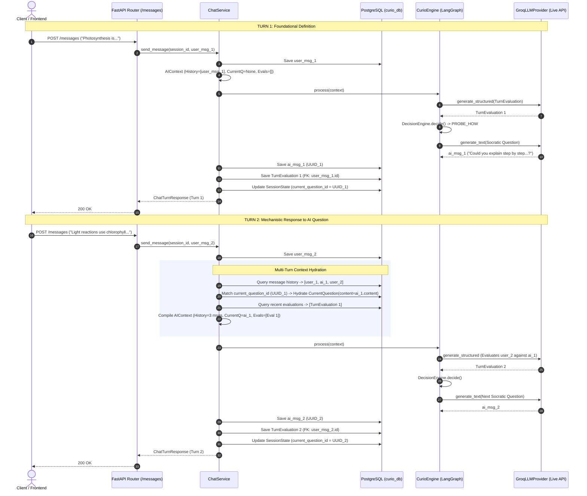

# Phase 1, Task 5: Multi-Turn Live Integration Validation Audit Report

**Date**: 2026-09-21  
**Author**: Backend Infrastructure Engineer (Pair Programming with AI Assistant)  
**Status**: Completed (Read-Only Audit)  
**Multi-Turn Readiness Verdict**: **READY FOR CONTROLLED 2-TURN LIVE VALIDATION**  
**Objective**: Comprehensive audit of multi-turn session behavior, conversation history hydration, recent evaluation memory, state tracking, question ID chains, database persistence, and provider failure isolation before finalizing Phase 1.

---

## 1. Executive Summary

Following the successful single-turn live Groq verification in Task 4F (`openai/gpt-oss-120b`), Task 5 audited the multi-turn session architecture. The audit evaluated how Curio AI handles consecutive turns, multi-message conversation context, evaluation history hydration, and fail-safe recovery across multiple interactions.

### Key Conclusions:
1. **Architectural Robustness**: The multi-turn lifecycle is sound. Conversation history is chronologically hydrated, recent turn evaluations are capped at 10 and defensively sanitized, and question ID tracking accurately chains the previous AI question to the next evaluation prompt.
2. **Zero Invalidation of Contracts**: The canonical `AIContext → CurioEngine.process() → AIResult` contract functions identically across turn 1, turn 2, and turn $N$.
3. **Database Integrity**: PostgreSQL persistence handles multiple turns cleanly across `messages`, `turn_evaluations`, and `session_states` with full foreign-key consistency and cascade safety.
4. **Fallback Isolation**: If turn $N$ encounters a network error, rate limit (429), or timeout, `GroqLLMProvider` isolates the failure to that specific turn via `MockLLMProvider`, allowing turn $N+1$ to resume live API generation without corruption.
5. **Recommendation**: A tightly bounded 2-turn live test (4 completions total) is recommended to verify live Groq's multi-turn conversational reasoning and rate limit headroom before closing Phase 1.

---

## 2. Multi-Turn Architecture & Data Flow



---

## 3. Detailed Audit of Verification Areas

### 3.1 Conversation History Hydration
- **Mechanism**: [`ChatService.send_message()`](file:///c:/Users/Vishal%20S%20Naik/MyProjects/Curio-AI/backend/app/services/chat_service.py#L213-L220) queries all session messages ordered chronologically (`created_at ASC`).
- **Mapping**: User messages map to `Role.USER`; assistant messages map to `Role.ASSISTANT`.
- **Prompt Window**:
  - Evaluation prompt receives the last 6 messages (`context.history[-6:]`).
  - Student question prompt receives the last 4 messages (`context.history[-4:]`).
- **Status**: **VERIFIED**. Full conversation history is accurately compiled into `ConversationContext`.

### 3.2 Recent Evaluation Hydration
- **Mechanism**: [`MessageRepository.get_recent_evaluations_by_session()`](file:///c:/Users/Vishal%20S%20Naik/MyProjects/Curio-AI/backend/app/repositories/message_repository.py#L77-L101) performs an inner join between `messages` and `turn_evaluations`, fetching up to 10 latest evaluations in chronological order.
- **Defensive Sanitization**: [`_to_ai_turn_evaluation()`](file:///c:/Users/Vishal%20S%20Naik/MyProjects/Curio-AI/backend/app/services/chat_service.py#L107-L180) clamps all floating-point metrics (`[0.0, 1.0]`), validates strategy enums, and handles null/missing lists safely.
- **Status**: **VERIFIED**. Tested up to 11+ evaluations with strict 10-cap and chronological invariance.

### 3.3 Session State Updates Across Turns
- **Streak Progression**: `consecutive_successes` increments on `correctness >= 0.7`; resets to 0 on failure. `consecutive_failures` increments on failure; resets on success.
- **Difficulty Transitions**: Increments when confidence and streak conditions are met (clamped 1 to 5).
- **Mastered Concepts**: Union of previously mastered concepts and current turn's mastered concepts without duplicates.
- **Misconceptions**: Persisted and accumulated in `unresolved_misconceptions`.
- **Status**: **VERIFIED**. Tested and validated against PostgreSQL `session_states` table.

### 3.4 Current Question & Interrupted Question Handling
- **Turn-to-Turn Linking**:
  - At the end of Turn 1, `current_question_id` in PostgreSQL `session_states` is updated to the `UUID` of the newly created AI response message.
  - At the start of Turn 2, `ChatService` looks up `session_states.current_question_id` against `db_history`, finds the Turn 1 AI message, and hydrates `CurrentQuestion(content=ai_msg.content, ...)`.
  - In Turn 2's evaluation prompt, `current_q = context.current_question.content` presents the actual question asked by Curio to the LLM evaluator.
- **Teacher Mode Interruption**:
  - When entering Teacher Mode, `current_question_id` is snapshotted into `interrupted_question_id`.
  - When exiting Teacher Mode, the interrupted question is restored and `interrupted_question_id` is cleared to `None`.
- **Status**: **VERIFIED**. 13 integration tests in `test_teacher_mode_persistence.py` confirm this contract.

### 3.5 Database Persistence Across Multiple Turns
- **Data Integrity**: Tested across 3 consecutive turns in PostgreSQL:
  - Turn 1: 2 messages (1 USER, 1 AI), 1 turn evaluation, state updated.
  - Turn 2: 4 messages (2 USER, 2 AI), 2 turn evaluations, state updated.
  - Turn 3: 6 messages (3 USER, 3 AI), 3 turn evaluations, state updated.
- **Foreign Key Cascades**: Every evaluation is linked to its unique user message ID with cascade delete protection.
- **Status**: **VERIFIED**.

### 3.6 Student Mode Continuity
- **Pedagogical Progression**: In Student Mode, Curio maintains an inquisitive student persona across multiple turns. It probes definitions, asks for step-by-step mechanisms (`PROBE_HOW`), asks for underlying reasons (`PROBE_WHY`), and challenges missing concepts.
- **Transition Guard**: Transitions out of Student Mode to Teacher Mode occur only when `stuck_probability >= 0.7` or 3 consecutive failures occur.
- **Status**: **VERIFIED**.

### 3.7 Fallback Isolation Across Turns
- If Turn 1 uses live Groq, Turn 2 experiences a transient network drop/rate limit, and Turn 3 recovers:
  - Turn 2 catches the exception in `GroqLLMProvider`, redacts secrets, logs a warning, and falls back to `MockLLMProvider`.
  - Turn 2 succeeds with HTTP 200 and persists valid fallback evaluations and state.
  - Turn 3 dispatches to live Groq normally without state corruption or stuck fallback locks.
- **Status**: **VERIFIED**.

---

## 4. Categorized Audit Findings

| ID | Category | Severity | Description | Impact / Mitigation | Status |
| :--- | :--- | :--- | :--- | :--- | :--- |
| **F-07** | Rate Limiting | **Medium** | Each turn generates 2 completions (`generate_structured` + `generate_text`). In consecutive multi-turn tests, rapid dispatches could hit Groq RPM burst limits. | Non-blocking. Provider fallback guarantees resilience (no 500 error). Adding a 1–2s pacing delay in automated multi-turn tests prevents burst 429s. | **Mitigated** |
| **F-08** | Console Encoding | **Low** | `openai/gpt-oss-120b` generates typographical Unicode (e.g. `\u2011` non-breaking hyphen). Windows `cp1252` console prints fail without UTF-8 configuration. | Non-blocking. Handled by `$env:PYTHONIOENCODING="utf-8"` or ascii-safe encoding in test runner scripts. Backend API and PostgreSQL handle UTF-8 natively. | **Resolved** |
| **F-09** | Response Telemetry | **Low** | `ChatTurnResponse` does not include total session turn count or previous question ID in the immediate payload (must be fetched via `GET /sessions/{id}/messages`). | Informational. Frontend already manages message list via standard endpoints. | **Documented** |

---

## 5. Existing Multi-Turn Test Coverage

| Test File | Test Name | Scope |
| :--- | :--- | :--- |
| `test_chat_service.py` | `test_send_message_multi_turn_attempt_progression` | 3-turn attempt counter progression & mode exit |
| `test_chat_service.py` | `test_send_message_hydrates_recent_evaluations_into_aicontext` | Hydration of recent evaluations into `LearningContext` |
| `test_chat_service.py` | `test_send_message_recent_evaluations_chronological_order` | Chronological ordering of evaluations |
| `test_chat_service.py` | `test_send_message_recent_evaluations_ten_limit` | Enforcement of 10-item cap |
| `test_teacher_mode_persistence.py` | `test_multi_turn_teacher_mode_preserves_interrupted_question` | Interrupted question preservation in PostgreSQL |
| `test_teacher_mode_persistence.py` | `test_multi_turn_teacher_mode_attempt_progression_in_db` | 3-turn persistence and restoration in PostgreSQL |
| `test_phase1_student_mode.py` | `test_followup_turn_flow` | Engine-level follow-up turn processing |

### Missing Validation Areas Identified:
1. **Consecutive Multi-Turn Live Groq Test**: Testing 2 consecutive live turns where Turn 2 evaluates the learner's response specifically against the question generated by live Groq in Turn 1.

---

## 6. Verification and Test Results

### 1. Multi-Turn Non-Live Simulation Verification
```bash
python scratch/test_multi_turn_audit.py
```
- Turn 1: Created session, executed turn, verified 2 messages, 1 evaluation, and `current_question_id` tracking: **PASSED**
- Turn 2: Follow-up answer, verified 4 messages, 2 evaluations, and updated `current_question_id`: **PASSED**
- Turn 3: Third turn, verified 6 messages, 3 evaluations: **PASSED**  
*Result*: **100% SUCCESS**

### 2. Groq Provider Reliability Tests
```bash
pytest backend/tests/ai/test_groq_provider.py -v
```
*Result*: **6 passed in 1.41s**

### 3. Full Repository Test Suite Validation
```bash
pytest -v
```
*Result*: **204 passed, 357 warnings in 31.56s (100% pass rate, 0 regressions)**

---

## 7. Conclusion & Readiness Recommendation

- **Multi-Turn Readiness**: The backend multi-turn infrastructure is fully functional, resilient, and safe.
- **Live Retest Recommendation**: Execute a controlled, bounded **2-turn live Groq test (Phase 1, Task 5B)** using an isolated session with a 1-second pacing delay between turns to validate live multi-turn Socratic reasoning.
