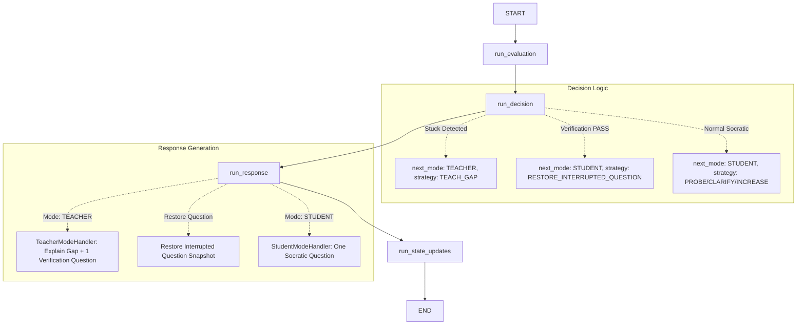

# Phase 2 — Teacher Mode & Gap-Specific Teaching Specification

## 1. Goal
When a learner is genuinely stuck during Socratic exploration in Student Mode, Curio temporarily transitions from **STUDENT** to **TEACHER**.
The Teacher Mode:
1. Identifies the exact knowledge gap preventing the learner from making progress.
2. Explains *only* that specific gap without broad lectures or solving the original question.
3. Asks exactly *one* verification question targeting the gap.
4. Verifies whether the learner now understands it.
5. If verified, seamlessly returns to Student Mode at the exact point where the learner was interrupted, restoring the original question snapshot.

---

## 2. Architecture & System Boundaries
Curio adheres to a strict layered boundary:

```text
Backend (FastAPI / ChatService)
    ↓
Load Session State & Hydrate Questions from PostgreSQL
    ↓
Build Canonical AIContext
    ↓
CurioEngine.process(AIContext)
    ↓
LangGraph State Machine (Internal Implementation Detail)
    ├── AIEvaluator (TurnEvaluation)
    ├── DecisionEngine (Deterministic Policy)
    ├── Mode Handlers: StudentModeHandler / TeacherModeHandler
    └── StateUpdatesNode (StateUpdates)
    ↓
AIResult
    ↓
ChatService merges StateUpdates into PostgreSQL
    ↓
API Response
```

* **Zero Direct Database Access**: The AI engine never accesses PostgreSQL, SQLAlchemy models, or FastAPI dependencies.
* **Invariant Public Interface**: `CurioEngine.process(AIContext) -> AIResult` remains the sole public interface for the AI layer.

---

## 3. Student → Teacher Transition
The transition is strictly deterministic and governed by `DecisionEngine`, not the LLM.

### Stuck Detection Policy:
* **Trigger A — Explicit Stuck Signals**:
  Learner uses phrases such as `"I don't know"`, `"I'm stuck"`, `"I don't understand"`, `"I'm confused"`, `"I have no idea"`, `"can you explain this?"`, `"idk"`, or `"help me"`.
* **Trigger B — High Stuck Probability with Evidence**:
  `stuck_probability >= 0.75` AND (`correctness < 0.5` OR a non-empty `knowledge_gap` exists).
* **Trigger C — Repeated Failure on the Same Knowledge Gap**:
  The same knowledge gap persists across consecutive turns with low correctness.

### Protection Against Over-Triggering:
A single misconception, missing concept, undefined term, or incomplete answer does **not** trigger Teacher Mode. Student Mode continues normal probing unless genuine stuck evidence is present.

---

## 4. Teacher Intervention Lifecycle
1. **Transition & Snapshot**:
   - `current_mode` becomes `TEACHER`.
   - `current_question` is saved into `interrupted_question` as a complete question snapshot (`id`, `content`, `concept`, `difficulty`).
   - `teacher_intervention` is initialized with `active=True`, the identified `gap`, and `attempt_count=1`.
2. **Gap-Specific Teaching & Verification**:
   - `TeacherModeHandler` generates a concise explanation (1-2 paragraphs) targeting *only* the gap.
   - Ends with exactly *one* verification question testing the gap.
3. **Verification Evaluation**:
   - Learner answers the verification question.
   - Evaluator scores the turn:
     - **PASS** (`correctness >= 0.7`, `stuck_probability < 0.4`, no severe misconception):
       - `next_mode = STUDENT`
       - `strategy = RESTORE_INTERRUPTED_QUESTION`
       - `should_restore_interrupted_question = True`
       - `interrupted_question` is restored to `current_question`.
       - `teacher_intervention` is cleared (`active=False`).
     - **FAIL** (`correctness < 0.7` or stuck):
       - Remains in `TEACHER` mode.
       - `attempt_count` increments.
       - Teacher adapts explanation on the next turn.

---

## 5. Attempt Limits & Loop Prevention
* **Maximum Attempts**: `MAX_TEACHER_ATTEMPTS = 3`.
* **Adaptation Strategy**:
  - **Attempt 1**: Clear, intuitive conceptual explanation.
  - **Attempt 2**: Concrete real-world analogy or intuitive example.
  - **Attempt 3**: Simple breakdown or tiny worked micro-example.
* **Fallback on Max Attempts**:
  If verification fails after 3 attempts, the system prevents infinite loops by:
  - Marking the gap as unresolved.
  - Exiting Teacher Mode to Student Mode (`next_mode = STUDENT`, `should_restore_interrupted_question = True`).
  - Stepping down to a simpler difficulty (`max(1, difficulty - 1)`).
  - Resuming Socratic exploration without crashing or getting stuck.

---

## 6. Interrupted Question Restoration
* The interrupted question is preserved in `SessionState.interrupted_question` and persisted in PostgreSQL as `interrupted_question_id`.
* Restoration restores:
  - Exact question `content`
  - Original `concept`
  - Original `difficulty` (or adjusted simpler difficulty if loop limit was reached)
* No unrelated or arbitrary new question is generated during restoration.

---

## 7. State Changes & Examples

### Before (Student Mode Turn):
```json
{
  "current_mode": "STUDENT",
  "difficulty": 2,
  "active_concept": "Binary Search",
  "current_question": {
    "id": "q_101",
    "content": "Why does binary search require a sorted array?",
    "concept": "Binary Search",
    "difficulty": 2
  },
  "interrupted_question": null,
  "teacher_intervention": null
}
```

### Transition to Teacher Mode:
```json
{
  "current_mode": "TEACHER",
  "difficulty": 2,
  "active_concept": "Ordering allows elimination of half the search space",
  "current_question": {
    "id": "q_102",
    "content": "Sorting gives us an ordering we can rely on... Why can we ignore everything after 10?",
    "concept": "Ordering allows elimination of half the search space",
    "difficulty": 2
  },
  "interrupted_question": {
    "id": "q_101",
    "content": "Why does binary search require a sorted array?",
    "concept": "Binary Search",
    "difficulty": 2
  },
  "teacher_intervention": {
    "active": true,
    "gap": "Ordering allows elimination of half the search space",
    "attempt_count": 1,
    "verification_required": true
  }
}
```

### Restoration to Student Mode (Verification Passed):
```json
{
  "current_mode": "STUDENT",
  "difficulty": 2,
  "active_concept": "Binary Search",
  "current_question": {
    "id": "q_101",
    "content": "Why does binary search require a sorted array?",
    "concept": "Binary Search",
    "difficulty": 2
  },
  "interrupted_question": null,
  "teacher_intervention": {
    "active": false,
    "gap": "",
    "attempt_count": 0,
    "verification_required": false
  }
}
```

---

## 8. LangGraph State Machine Flow


---

## 9. Backend Persistence Verification
* PostgreSQL `session_states` table already provides:
  - `current_mode`
  - `current_question_id`
  - `interrupted_question_id`
  - `consecutive_strong_answers`
  - `consecutive_weak_answers`
  - `unresolved_misconceptions`
  - `mastered_concepts`
* `ChatService` hydrates `CurrentQuestion` from message history using `current_question_id` and `interrupted_question_id`.
* Verified by `test_teacher_mode_persistence.py` with 100% pass rate.

---

## 10. Test Coverage Summary
* **AI Test Suite**: 87/87 passed (67 baseline + 20 Phase 2).
* **Full Backend Suite**: 145/145 passed, 0 failures, 0 errors.
* **Live Groq Smoke Test**: Verified end-to-end against live Groq inference.

---

## 11. Explicitly Deferred Features
The following remain explicitly deferred to future phases:
- Evaluator Mode
- Session summary reports
- RAG / document vector search
- Voice / audio pipeline
- 75% mastery termination
- Mistake injection
- Complex cross-session concept mastery graphs
