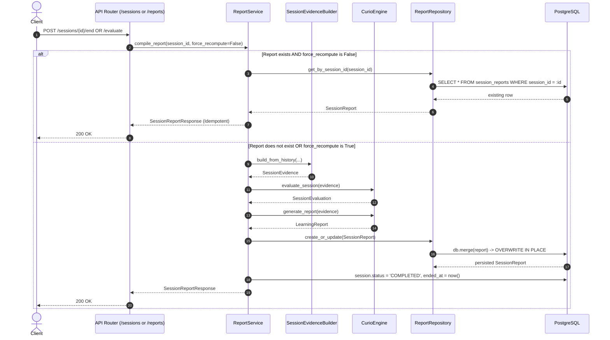
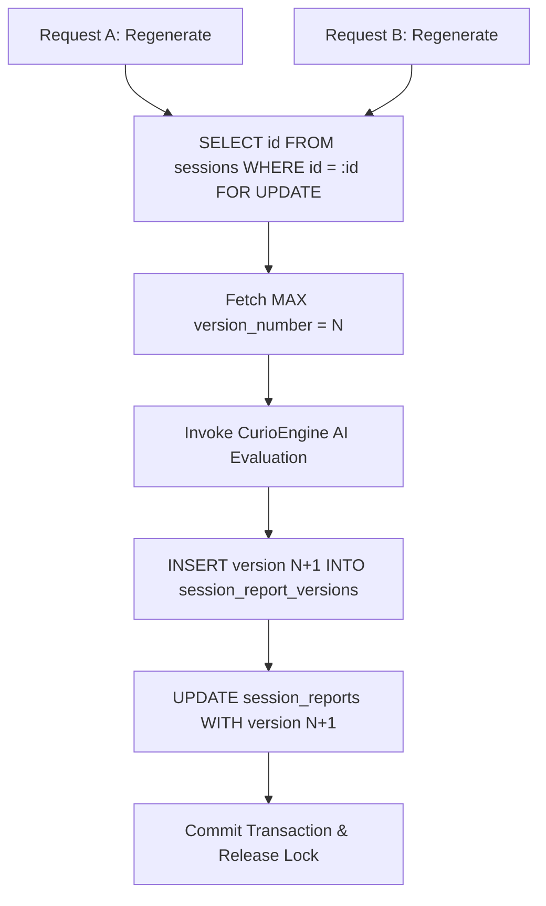

# Phase 4 Task 4.4 — Report Versioning & Regeneration Architecture Audit

## Executive Summary
This document provides the complete architecture audit for **Phase 4 Task 4.4: Report Versioning & Regeneration** in Curio AI.

The objective of Task 4.4 is to transition Curio AI's single-report mutable architecture into an immutable, versioned report system that:
1. Preserves all previously generated reports without accidental overwriting.
2. Allows learners and educators to explicitly regenerate reports as sessions progress.
3. Keeps historical report versions immutable and addressable.
4. Identifies the current/latest report version effortlessly.
5. Retains strict user ownership and IDOR protections.
6. Maintains 100% backward compatibility with all existing Phase 1–4.3 APIs, schemas, and test baselines.
7. Preserves the strict separation between AI reasoning and backend persistence.

---

## 1. Current Report Model Audit

### Database Model: `SessionReport` (`backend/app/models/report.py`)
- **Primary Key**: `session_id` (`UUID(as_uuid=True)`, `primary_key=True`, `index=True`).
- **Foreign Keys**: `ForeignKey("sessions.id", ondelete="CASCADE")`.
- **User Ownership Path**: Indirect via `session_id` -> `sessions.user_id` -> `users.id`. `session_reports` does **not** contain a `user_id` column.
- **Report Fields**:
  - `understanding_score`: `Float`, nullable=False, default=0.0
  - `mastery_level`: `String`, nullable=False, default="BEGINNER"
  - `strengths`: `JSON`, nullable=False, default=list
  - `high_priority_learning_gaps`: `JSON`, nullable=False, default=list
  - `medium_priority_learning_gaps`: `JSON`, nullable=False, default=list
  - `low_priority_learning_gaps`: `JSON`, nullable=False, default=list
  - `misconceptions_detected`: `JSON`, nullable=False, default=list
  - `concepts_mastered`: `JSON`, nullable=False, default=list
  - `teacher_interventions_required`: `Integer`, nullable=False, default=0
  - `difficulty_achieved`: `Integer`, nullable=False, default=1
  - `personalized_roadmap`: `JSON`, nullable=False, default=list
  - `recommended_exercises`: `JSON`, nullable=False, default=list
  - `evidence_confidence`: `Float`, nullable=False, default=0.0
  - `concept_assessments`: `JSON`, nullable=False, default=list
  - `resolved_gaps`: `JSON`, nullable=False, default=list
  - `unresolved_gaps`: `JSON`, nullable=False, default=list
  - `resolved_misconceptions`: `JSON`, nullable=False, default=list
  - `unresolved_misconceptions`: `JSON`, nullable=False, default=list
  - `session_evaluation`: `JSON`, nullable=True, default=dict
- **Timestamps**:
  - `created_at`: `DateTime(timezone=True)`, server_default=`func.now()`, nullable=False.
  - `updated_at`: **None**. There is no column tracking modifications or updates.
- **Mutability & Replaceability**: **Highly mutable and replaceable**. Because `session_id` is the single primary key, only one row can exist per session.
- **Versioning**: **Non-existent**. There is no `version`, `version_number`, or revision tracking.
- **Historical Recoverability**: **Impossible**. When a report is regenerated, the previous row is overwritten in place via SQLAlchemy `db.merge()`. Historical report data is permanently destroyed.
- **Idempotency**: `compile_report(..., force_recompute=False)` is idempotent and returns the existing row. However, with `force_recompute=True`, it destroys the previous row.
- **Existing Report History Mechanism**: None in the codebase.

---

## 2. Current Report Generation Flow



### Specific Lifecycle Inquiries:
- **A. What triggers report generation?**
  1. `POST /api/v1/sessions/{session_id}/end`: Ends the session and calls `report_service.compile_report()`.
  2. `POST /api/v1/sessions/{session_id}/evaluate`: Explicitly calls `report_service.compile_report()`.
- **B. Can reports be generated multiple times?**
  Yes, but currently the HTTP endpoints do not pass `force_recompute=True`. Python service tests and direct code can pass `force_recompute=True`.
- **C. What happens when the report already exists?**
  If `force_recompute=False`, it returns the existing persisted report immediately without invoking AI (idempotent).
- **D. Does regeneration overwrite the existing report?**
  **Yes**. `ReportRepository.create_or_update` executes `merged = db.merge(report); db.commit()`. Since `session_id` is the primary key, it updates the row in place.
- **E. Is the current report deterministic?**
  In mock mode, yes. In live LLM mode (Groq), LLM completions have slight stochasticity; regenerating a report produces distinct wording, advice, and potentially varying scores.
- **F. Does `force_recompute` already exist?**
  Yes, as a parameter in `ReportService.compile_report(db, session_id, force_recompute=False, user_id=None)` (`backend/app/services/report_service.py` line 54). It is **not** exposed in any API route.
- **G. Does `force_recompute` currently mutate the same `SessionReport` row?**
  Yes, mutating the existing record.
- **H. Does ending a session generate a report?**
  Yes, `POST /api/v1/sessions/{session_id}/end` compiles and returns the report.
- **I. Does explicit evaluation generate a report?**
  Yes, `POST /api/v1/sessions/{session_id}/evaluate` compiles and returns the report.
- **J. Can a report be generated for an incomplete session?**
  Yes, `POST /api/v1/sessions/{session_id}/evaluate` can be invoked while `status == ACTIVE`. However, `compile_report` internally marks `db_session.status = "COMPLETED"` and `db_session.ended_at = now()` whenever a report is persisted.
- **K. What happens if report generation fails?**
  If `CurioEngine` raises an exception (e.g. LLM failure/timeout), execution halts, raising an unhandled exception (HTTP 500). No report is written, and session status is not updated.
- **L. What happens if persistence fails after AI generation?**
  Database rolls back; AI generation output is lost.
- **M. Are report generation and session completion in the same transaction?**
  **Partially broken boundary**: `report_repo.create_or_update()` calls `db.commit()` on line 174 of `report_service.py`, and then line 177 calls `db.commit()` a second time for session status. This creates a two-commit window where status could fail after the report was committed.

---

## 3. Current Report Schema Classification

| Field Name | Type | Classification | Safe to Copy to Version? |
|------------|------|----------------|--------------------------|
| `session_id` | `UUID` | Identifier / Ownership | Yes |
| `understanding_score` | `Float` | Generated by AI | Yes |
| `mastery_level` | `String` | Generated by AI | Yes |
| `strengths` | `JSON` (`List[str]`) | Generated by AI | Yes |
| `high_priority_learning_gaps` | `JSON` (`List[str]`) | Generated by AI | Yes |
| `medium_priority_learning_gaps` | `JSON` (`List[str]`) | Generated by AI | Yes |
| `low_priority_learning_gaps` | `JSON` (`List[str]`) | Generated by AI | Yes |
| `misconceptions_detected` | `JSON` (`List[str]`) | Generated by AI | Yes |
| `concepts_mastered` | `JSON` (`List[str]`) | Generated by AI / Derived | Yes |
| `teacher_interventions_required` | `Integer` | Generated by AI / Evidence | Yes |
| `difficulty_achieved` | `Integer` | Generated by AI / Evidence | Yes |
| `personalized_roadmap` | `JSON` (`List[dict]`) | Generated by AI | Yes |
| `recommended_exercises` | `JSON` (`List[str]`) | Generated by AI | Yes |
| `evidence_confidence` | `Float` | Generated by AI | Yes |
| `concept_assessments` | `JSON` (`List[dict]`) | Generated by AI | Yes |
| `resolved_gaps` | `JSON` (`List[str]`) | Generated by AI | Yes |
| `unresolved_gaps` | `JSON` (`List[str]`) | Generated by AI | Yes |
| `resolved_misconceptions` | `JSON` (`List[str]`) | Generated by AI | Yes |
| `unresolved_misconceptions` | `JSON` (`List[str]`) | Generated by AI | Yes |
| `session_evaluation` | `JSON` (`Dict[str, Any]`) | Generated by AI | Yes |
| `created_at` | `DateTime(tz=True)` | Timestamp / Backend Metadata | Yes (as version `created_at`) |

**Audit Conclusion**: All fields represent the point-in-time output of an evaluation run. None are transient or reference volatile rows. Every field can safely be captured in an immutable versioned record.

---

## 4. Report Immutability Audit

### Conceptual Test:
```
Session 123
├── 1. Generate Report -> Version 1 persisted (Score: 82, Gaps: ["base cases"])
└── 2. Trigger Regeneration -> Version 2 generated (Score: 88, Gaps: [])
```

### Current Outcome:
- **Version 1 does NOT survive.**
- `ReportRepository.create_or_update`:
  ```python
  def create_or_update(self, db: SQLAlchemySession, report: SessionReport) -> SessionReport:
      merged = db.merge(report)
      db.commit()
      db.refresh(merged)
      return merged
  ```
  Since `session_id` is the primary key of `session_reports`, PostgreSQL executes:
  `UPDATE session_reports SET understanding_score = 88, ... WHERE session_id = '123'`.
- All scores, insights, gaps, and roadmap entries from Version 1 are irrevocably lost.

### Overwrite Paths in Code:
1. `ReportService.compile_report(..., force_recompute=True)` -> Calls `self.report_repo.create_or_update()`.
2. Any external invocation of `ReportRepository.create_or_update()` with an existing `session_id`.

---

## 5. Versioning Design Options

We evaluate four structural patterns against 12 architectural criteria:

| Evaluation Criteria | Option A: Add Version Columns to `SessionReport` (Compound PK) | Option B: Dedicated `session_report_versions` Table + Latest Cache in `SessionReport` | Option C: Dedicated `session_report_versions` Table + Current Pointer FK | Option D: Replace `SessionReport` Entirely with `report_versions` |
|---------------------|---------------------------------------------------------------|--------------------------------------------------------------------------------------|--------------------------------------------------------------------------|-------------------------------------------------------------------|
| **1. Historical Immutability** | Moderate (relies on append-only logic; rows are mixed) | **Excellent** (version table is append-only; historical rows are never updated) | **Excellent** (same as B) | **Excellent** (all rows append-only) |
| **2. Database Integrity** | Moderate (breaks existing 1:1 FK from `sessions.id` to `session_reports.session_id`) | **High** (FKs cleanly defined: `session_reports` remains 1:1, versions are 1:N) | High (circular FK between `sessions` and `versions` adds migration complexity) | High (1:N relationship from sessions) |
| **3. Ownership** | Via session | Via session | Via session | Via session |
| **4. Query Complexity** | High (every query must filter `WHERE version = MAX(version)`) | **Low** (Latest query is simple `SELECT * FROM session_reports`; history is `SELECT * FROM session_report_versions`) | Moderate (requires joining on pointer) | High (requires subquery or window function `ROW_NUMBER()`) |
| **5. API Complexity** | Moderate | **Low** (preserves existing routes 100%) | Moderate | High (all endpoints need subqueries) |
| **6. Migration Complexity** | High (must drop PK, alter schema, update constraints) | **Low & Safe** (create `session_report_versions`, seed from existing `session_reports`, zero breaking DDL) | High (adds new tables and circular FK) | High (drops/renames existing tables, breaks existing code) |
| **7. Backward Compatibility** | **Fails** (breaks existing ORM relationship `session.report`) | **100% Compatible** (`session.report`, `GET /report`, and Phase 4.3 Timeline remain unchanged) | High | **Fails** (breaks `session.report` relationship and timeline queries) |
| **8. Report Regeneration** | Append row with `version + 1` | Append row to versions, update `session_reports` cache | Append row, update pointer | Append row with `version + 1` |
| **9. Concurrent Regeneration** | Race conditions on `MAX(version)` | Handled via DB unique constraint `(session_id, version_number)` + row lock | Handled via constraints | Handled via constraints |
| **10. Storage Growth** | Linear | Linear (negligible: ~2KB per version) | Linear | Linear |
| **11. Frontend Compatibility**| May require changes | **100% Compatible** (existing `/report` endpoint returns identical shape) | Compatible | May require changes |
| **12. Testing Complexity** | High (existing test fixtures break) | **Low** (all 598 baseline tests + 36 timeline tests continue passing unmodified) | Moderate | High (rewrites across test suite) |

### Comparative Analysis:
- **Option A** breaks the primary key structure of `session_reports`, turning it into a multi-row table. This breaks SQLAlchemy's `uselist=False` relationship on `Session.report`, breaking dozens of existing tests and timeline aggregation queries.
- **Option C** introduces circular foreign keys (`session_reports.current_version_id -> session_report_versions.id`, while `session_report_versions.session_id -> sessions.id`), complicating Alembic migrations and cascading deletes.
- **Option D** breaks backward compatibility with all Phase 1–4.3 code that references `session_reports` (e.g. `test_phase3_api.py`, `test_session_idor.py`, and `timeline_repository.py`).
- **Option B** is the clear winner:
  1. `session_reports` continues to act as the **Current/Latest Snapshot** (preserving 100% backward compatibility for existing endpoints, frontend calls, and Phase 4.3 timeline queries).
  2. `session_report_versions` stores the **Immutable Append-Only Audit Trail** of all report generations (Version 1, Version 2, etc.).

---

## 6. Recommended Database Design

### New Table: `session_report_versions`
```sql
CREATE TABLE session_report_versions (
    id UUID PRIMARY KEY DEFAULT gen_random_uuid(),
    session_id UUID NOT NULL REFERENCES sessions(id) ON DELETE CASCADE,
    version_number INTEGER NOT NULL,
    
    -- Report Data (Typed Columns matching SessionReport for queryability and consistency)
    understanding_score FLOAT NOT NULL DEFAULT 0.0,
    mastery_level VARCHAR NOT NULL DEFAULT 'BEGINNER',
    strengths JSONB NOT NULL DEFAULT '[]'::jsonb,
    high_priority_learning_gaps JSONB NOT NULL DEFAULT '[]'::jsonb,
    medium_priority_learning_gaps JSONB NOT NULL DEFAULT '[]'::jsonb,
    low_priority_learning_gaps JSONB NOT NULL DEFAULT '[]'::jsonb,
    misconceptions_detected JSONB NOT NULL DEFAULT '[]'::jsonb,
    concepts_mastered JSONB NOT NULL DEFAULT '[]'::jsonb,
    teacher_interventions_required INTEGER NOT NULL DEFAULT 0,
    difficulty_achieved INTEGER NOT NULL DEFAULT 1,
    personalized_roadmap JSONB NOT NULL DEFAULT '[]'::jsonb,
    recommended_exercises JSONB NOT NULL DEFAULT '[]'::jsonb,
    evidence_confidence FLOAT NOT NULL DEFAULT 0.0,
    concept_assessments JSONB NOT NULL DEFAULT '[]'::jsonb,
    resolved_gaps JSONB NOT NULL DEFAULT '[]'::jsonb,
    unresolved_gaps JSONB NOT NULL DEFAULT '[]'::jsonb,
    resolved_misconceptions JSONB NOT NULL DEFAULT '[]'::jsonb,
    unresolved_misconceptions JSONB NOT NULL DEFAULT '[]'::jsonb,
    session_evaluation JSONB DEFAULT '{}'::jsonb,
    
    -- Metadata
    created_at TIMESTAMPTZ NOT NULL DEFAULT now(),
    
    -- Integrity & Uniqueness
    CONSTRAINT uq_session_report_version UNIQUE (session_id, version_number)
);

-- Indexing for fast chronological retrieval and pagination
CREATE INDEX ix_session_report_versions_session_version 
    ON session_report_versions(session_id, version_number DESC);

CREATE INDEX ix_session_report_versions_session_created 
    ON session_report_versions(session_id, created_at DESC);
```

### Table Column Design Decision: Typed Columns vs. JSON Blob
- **Recommendation**: **Typed Columns (matching `SessionReport`)**.
- **Rationale**:
  1. Full parity with `SessionReport` schema and Pydantic response models (`SessionReportResponse`).
  2. Direct queryability in SQL (e.g. analytics, timeline integration, mastery comparisons over versions).
  3. No serialization/deserialization overhead.
  4. Easy conversion between `SessionReport` and `SessionReportVersion`.

---

## 7. Version Numbering Strategy

### Design:
- **Per-Session Sequential Numbering**: `1, 2, 3, ...`
- **First Report**: Always `version_number = 1`.
- **Regenerated Reports**: `MAX(version_number) + 1` for that `session_id`.
- **Concurrency Safety**:
  - PostgreSQL unique constraint: `CONSTRAINT uq_session_report_version UNIQUE (session_id, version_number)`.
  - Transaction-level lock: `SELECT id FROM sessions WHERE id = :session_id FOR UPDATE` before computing the next version number.
  - If a concurrent transaction commits first, the second transaction catches `IntegrityError` (duplicate version number) and safely retries.

---

## 8. Current / Latest Report Semantics

### Determination:
1. **Via `SessionReport`**: The `session_reports` table always stores the **latest/current version**.
2. **Via `session_report_versions`**: The highest `version_number` for that `session_id`.
3. **Synchronization**:
   When a new report version $N$ is created:
   - Insert row into `session_report_versions` with `version_number = N`.
   - Update `session_reports` with the same values plus `version_number = N` (or mirror).
4. **Edge Cases**:
   - *No report exists*: `GET /sessions/{id}/report` returns HTTP 404; `GET /sessions/{id}/reports` returns empty items list (`total = 0`).
   - *One report exists*: Version 1 is both the first and latest report.
   - *Multiple versions exist*: Latest returns Version $N$; history lists $1 \dots N$.
   - *Newer generation fails*: The transaction rolls back; Version $N-1$ remains untouched as latest.

---

## 9. Regeneration Semantics

### Endpoint:
`POST /api/v1/sessions/{session_id}/report/regenerate`

### Behavioral Rules:
1. **Authentication**: Required (`Depends(get_current_active_user)`).
2. **Ownership Enforcement**: Session must belong to `current_user.id`; returns **HTTP 404** if not found or foreign.
3. **Session State Prerequisite**:
   - Session must have interaction history (at least 1 user message / turn).
   - If session has no interactions, return **HTTP 400 Bad Request** (`"Cannot generate report for session with no interaction history"`).
   - Works for both `COMPLETED` sessions and active sessions (finalizes and marks `COMPLETED`).
4. **Immutability Guarantee**: Existing rows in `session_report_versions` are **NEVER updated or deleted**.
5. **New Version Allocation**: Increments version to $N+1$.
6. **Return Payload**: Returns the newly generated report with `version_number` populated.
7. **Idempotency**: Regeneration is an **explicit recompute action**; each invocation deliberately produces a new version.

---

## 10. Report History API

### Recommended Endpoints:

#### 1. `GET /api/v1/sessions/{session_id}/reports`
- **Purpose**: Paginated list of all report versions for a session.
- **Parameters**: `page` (default 1), `page_size` (default 20, max 100).
- **Ordering**: `version_number DESC` (newest first).
- **Ownership**: 404 for nonexistent or foreign sessions.
- **Response**:
  ```json
  {
    "items": [
      {
        "id": "uuid",
        "session_id": "uuid",
        "version_number": 2,
        "understanding_score": 88.0,
        "mastery_level": "PROFICIENT",
        "created_at": "2026-10-03T20:00:00Z",
        ...
      },
      {
        "id": "uuid",
        "session_id": "uuid",
        "version_number": 1,
        "understanding_score": 75.0,
        "mastery_level": "DEVELOPING",
        "created_at": "2026-10-03T19:00:00Z",
        ...
      }
    ],
    "total": 2,
    "page": 1,
    "page_size": 20,
    "pages": 1
  }
  ```

#### 2. `GET /api/v1/sessions/{session_id}/reports/{version_number}`
- **Purpose**: Retrieve a specific historical version.
- **Ownership**: 404 for nonexistent session, foreign session, or nonexistent version number.
- **Response**: Full `SessionReportVersionResponse`.

---

## 11. Backward Compatibility

### Existing Endpoint: `GET /api/v1/sessions/{session_id}/report`
- **Guaranteed Compatibility**: Must continue to return the **latest report**.
- **Schema Compatibility**: Adding optional `version_number: int = 1` to `SessionReportResponse` is 100% backward compatible with existing frontend code.
- **Frontend Audit**:
  - `frontend/services/gapReportService.ts` line 26 defines `BackendReportResponse`.
  - Adding `version_number?: number` will not break any TypeScript contracts or runtime parsing.

---

## 12. Evidence and Report Snapshots

### Architectural Analysis:
- **Option A (Report Versioning Only)**: Report versions store AI output; when regeneration occurs, evidence is gathered from current session history (messages, turn evaluations, teacher interventions).
- **Option B (Full Evidence Snapshotting)**: Also persist an exact serialized snapshot of `SessionEvidence` for each report version.

### Recommendation:
- **Phase 4.4 Scope**: Implement **Report Output Versioning (Option A)**.
- **Rationale**:
  1. In Curio AI, once a session is completed, messages and evaluations are already immutable! Messages and turn evaluations are append-only.
  2. Full `SessionEvidenceSnapshot` persistence is explicitly earmarked for **Phase 4.7 (Export & Evidence Snapshotting)**.
  3. Attempting to build full evidence snapshotting in Phase 4.4 would duplicate Phase 4.7 and blow out scope.

---

## 13. Concurrency Strategy



1. **Session-Level Lock**:
   Acquire row lock on session: `db.query(Session).filter_by(id=session_id).with_for_update().first()`.
2. **Version Allocation**:
   `SELECT COALESCE(MAX(version_number), 0) FROM session_report_versions WHERE session_id = :session_id`. Next version = `MAX + 1`.
3. **Database Constraint**:
   `UNIQUE (session_id, version_number)` guarantees no duplicate versions can ever be written.

---

## 14. Failure & Rollback Semantics

| Failure Point | System State | Consequence / Recovery |
|---------------|--------------|------------------------|
| **1. AI Generation Fails** | No DB writes started | Transaction never opens for persistence. Previous latest report remains completely active. HTTP 500 returned. |
| **2. DB Persistence Fails** | Version write fails | Transaction rolls back. No version record created. Existing report row unchanged. |
| **3. Duplicate Version Conflict** | Unique constraint triggers | Transaction rolls back cleanly. Retry logic catches error. |
| **4. Existing Report Unharmed** | Historical versions are append-only | Previous versions cannot be corrupted because UPDATE queries are never executed on `session_report_versions`. |

---

## 15. Ownership & Security (IDOR Protection)

All report version endpoints enforce strict multi-tenant isolation:
1. **User Identity**: `current_user.id` extracted from validated JWT token.
2. **Anti-Enumeration 404**:
   If `session_id` does not exist OR `session.user_id != current_user.id`, the endpoint immediately aborts with `HTTP 404 ("Session not found")`.
3. **Version IDOR**:
   A user cannot probe version numbers of other users. Foreign session queries always terminate with 404 before checking report versions.

---

## 16. Performance Considerations

1. **Storage Growth**:
   Each `session_report_versions` row is ~2–4 KB. Even with 10 regenerations per session, storage impact is negligible (~40 KB).
2. **Index Optimization**:
   Composite index `(session_id, version_number DESC)` allows $O(1)$ index lookups for latest version and efficient range scans for paginated history.
3. **Payload Bounding**:
   `GET /reports` list endpoint can either return summary metadata or paginated items with default `page_size = 20`.

---

## 17. AI Boundary Verification

| Responsibility | Component | Status |
|----------------|-----------|--------|
| Trigger Generation | `ReportService` / API Router | Backend Persistence |
| Assemble Evidence | `SessionEvidenceBuilder` | Backend Persistence |
| Determine Score / Mastery | `CurioEngine` (`SessionEvaluator`) | **AI Logic** |
| Determine Learning Gaps | `CurioEngine` (`SessionEvaluator`) | **AI Logic** |
| Allocate Version Number | `ReportRepository` | Backend Persistence |
| Persist Version Record | `ReportRepository` | Backend Persistence |
| Paginate / Filter History | `ReportRepository` | Backend Persistence |

**Confirmation**: Zero AI logic or pedagogical scoring will be modified or added in backend persistence code.

---

## 18. Frontend Contract Impact

- **Existing Contracts**:
  - `frontend/services/gapReportService.ts` uses `BackendReportResponse`.
  - Adding `version_number: int` and `id: UUID` to `SessionReportResponse` is completely backward compatible.
- **New Capabilities Enabled**:
  - History drawer/selector showing report versions.
  - "Regenerate Report" button calling `POST /api/v1/sessions/{id}/report/regenerate`.

---

## 19. Test Coverage Audit

### Existing Test Suite (Verified Baseline):
- `backend/tests/api/test_phase3_api.py`: Covers basic report generation, idempotency, and session end.
- `backend/tests/api/test_session_idor.py`: Covers 401/404 ownership checks on `/report`.
- `backend/tests/api/test_timeline.py`: Covers `report_generated` timeline aggregation.

### Required New Tests for Phase 4.4:
1. `test_first_report_creates_version_1`
2. `test_subsequent_regeneration_creates_version_2`
3. `test_historical_version_1_remains_unchanged_after_regeneration`
4. `test_get_report_returns_latest_version`
5. `test_get_reports_list_returns_all_versions_ordered_desc`
6. `test_get_specific_version_by_number`
7. `test_get_nonexistent_version_returns_404`
8. `test_foreign_session_reports_list_returns_404`
9. `test_foreign_session_report_version_returns_404`
10. `test_foreign_session_regenerate_returns_404`
11. `test_unauthenticated_regenerate_returns_401`
12. `test_regenerate_empty_session_returns_400`
13. `test_regeneration_concurrent_locking_and_unique_constraint`
14. `test_backward_compatibility_get_report_response_shape`
15. `test_timeline_integration_reflects_report_generations`

---

## 20. Migration Audit

### Target Revision:
- **Parent Revision**: `7a8b9c0d1e2f` (current head)
- **New Table**: `session_report_versions`
- **Data Migration**:
  For all existing rows in `session_reports`, backfill a row in `session_report_versions` with `version_number = 1`, copying all existing report fields and `created_at`.
- **Zero-Report Sessions**: Handled automatically; no rows backfilled.
- **Downgrade**: Drops `session_report_versions` and associated indexes; `session_reports` remains intact.

---

## 21. Recommended Implementation Plan

1. **4.4.1 Database Model**:
   Define `SessionReportVersion` model in `backend/app/models/report_version.py` (or `report.py`) with FK to `sessions.id` and unique constraint `(session_id, version_number)`.
2. **4.4.2 Alembic Migration**:
   Generate migration script inheriting from `7a8b9c0d1e2f` to create table and backfill existing reports as Version 1.
3. **4.4.3 Schemas**:
   Add `SessionReportVersionResponse`, `SessionReportHistoryListResponse`, and add optional `version_number: int` to `SessionReportResponse`.
4. **4.4.4 Repository Layer**:
   Create `ReportVersionRepository` with `create_version`, `get_latest_version`, `get_by_version_number`, and `list_versions_paginated`.
5. **4.4.5 Service Layer**:
   Update `ReportService`:
   - `compile_report`: writes version 1 on initial compilation.
   - `regenerate_report`: allocates version $N+1$, writes to version table, and updates `SessionReport` cache.
   - `list_report_history`: returns paginated history.
   - `get_report_version`: returns specific version.
6. **4.4.6 API Endpoints**:
   - `POST /api/v1/sessions/{session_id}/report/regenerate`
   - `GET /api/v1/sessions/{session_id}/reports`
   - `GET /api/v1/sessions/{session_id}/reports/{version_number}`
7. **4.4.7 Targeted Integration Tests**:
   Create `backend/tests/api/test_report_versioning.py` covering all 15 new test cases.
8. **4.4.8 Regression & Verification**:
   Run targeted tests and directly related regression suites (`test_phase3_api.py`, `test_session_idor.py`, `test_timeline.py`).

---

## 22. Files Expected to Change in Implementation

| Component | Target File | Action |
|-----------|-------------|--------|
| **Model** | `backend/app/models/report_version.py` | Create new model |
| **Model** | `backend/app/models/session.py` | Add `report_versions` relationship |
| **Migration** | `backend/alembic/versions/<hash>_add_report_versions.py` | Create Alembic migration |
| **Schema** | `backend/app/schemas/report.py` | Add versioned response schemas |
| **Repository** | `backend/app/repositories/report_version_repository.py` | Create repository |
| **Service** | `backend/app/services/report_service.py` | Add regeneration & history logic |
| **Router** | `backend/app/api/v1/reports.py` | Add history and version lookup routes |
| **Router** | `backend/app/api/v1/sessions.py` | Add regenerate route |
| **Tests** | `backend/tests/api/test_report_versioning.py` | Create comprehensive tests |

---

## 23. Risks & Trade-Offs

1. **Double-Write Overhead**:
   Updating both `session_reports` and `session_report_versions` takes ~2ms more per generation.
   *Mitigation*: Report generation occurs at session conclusion or explicit user request, taking ~1–3s for AI evaluation. 2ms DB write is unnoticeable.
2. **Concurrent Regeneration Race**:
   Two fast clicks on "Regenerate" could trigger concurrent LLM calls.
   *Mitigation*: Database row lock on session during version increment, plus `UNIQUE(session_id, version_number)` constraint.

---

## 24. Final Recommendation

Adopt **Option B** (Dedicated `session_report_versions` table with latest cache in `session_reports`). It achieves:
- **100% Immutability**: Historical reports are never modified or overwritten.
- **100% Backward Compatibility**: Existing endpoints, frontend types, test suites, and Phase 4.3 timeline queries continue working seamlessly.
- **Clear Data Integrity**: Clean separation between current active state and historical audit records.

---

### Explicit Confirmations
- ✅ No production code modified
- ✅ No migrations created
- ✅ No database reset
- ✅ No database schema changed
- ✅ No AI logic changed
- ✅ No CurioEngine changes
- ✅ No LangGraph changes
- ✅ No prompts changed
- ✅ Full test suite was **NOT** rerun
