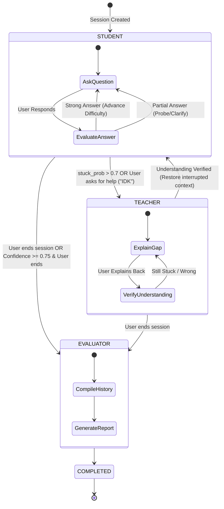

# State Machine & Mode Transitions

Curio AI reverses the traditional chatbot dynamic. The user acts as the teacher, and the AI acts as a student. This document explains the modes and transition rules of the learning loop.

## Modes

1. **STUDENT Mode**
   - The AI acts as a curious student trying to learn a topic.
   - It asks questions starting from foundation definitions, moving toward mechanism, application, edge-cases, and trade-offs.
   - If the user provides a vague or incomplete answer, the AI follows up to clarify.

2. **TEACHER Mode**
   - Triggers when the user is stuck, requests help, or repeatedly demonstrates critical misconceptions.
   - The AI explains the specific knowledge gap clearly and asks the user to explain it back to verify understanding.
   - Once verified, the AI transitions back to STUDENT mode and restores the previous questioning context.

3. **EVALUATOR Mode**
   - Triggers when the session ends.
   - Compiles all historical evaluations and constructs a structured learning report showing understanding scores, mastered concepts, and a custom learning roadmap.

---

## State Transition Diagram

## Deterministic Rule Set

The AI provider does **not** decide when to change modes. Instead, it generates a structured evaluation (`stuck_probability`, `misconceptions`, etc.). The decision engine then applies the following deterministic rules:

- **Transition to TEACHER**:
  - `stuck_probability` > 0.7 OR user message contains helper phrases ("idk", "i don't know", "can you explain", "stuck").
  - System stores the current question as `interrupted_question_id` and shifts mode.
- **Transition to STUDENT (from TEACHER)**:
  - User's explanation score for the injected gap exceeds 0.7.
  - System recovers the `interrupted_question_id` and returns to STUDENT mode.
- **Termination Offering**:
  - If confidence reaches >= 75%, set `should_offer_termination = True`. The frontend asks the user if they'd like to end. If they accept, shift to `EVALUATOR`.
- **Manual Termination**:
  - Session endpoint receives POST `/end` -> state immediately set to `EVALUATOR`.
